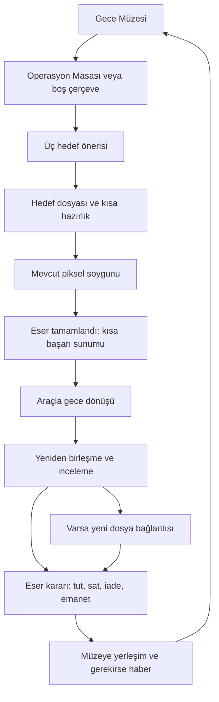

# Pixel Heist — Kayıp Envanter

**Hikâye, ilerleme, koleksiyon ve ekran tasarımı — Türkçe sürüm**

Belge: `PH-DESIGN` · Revizyon: `2026-09-23-r12` · Dil: `tr`  
İngilizce asıl ve AI uygulama kaynağı: [GameDesign.md](GameDesign.md). Bu Türkçe sürüm aynı tasarımın okuma karşılığıdır; çatışmada en son kullanıcı talimatı, ardından İngilizce belge esas alınır.
Fazlı uygulama planı: [ToDoList.md](../ToDoList.md) / [Türkçe](../ToDoList.tr.md).  
Tarih: 20 Eylül 2026  
Durum: Tam oyun için tasarım önerisi. Bu dosyanın oluşturulması, aşağıdaki yeni sistemlerin oyuna uygulandığı anlamına gelmez.

## 1. Önerinin özü

**Bir sanat hırsızı olarak hangi eserlerin peşinden gideceğine karar ver; çaldıklarınla kendi gece müzeni ve mesleki kimliğini oluştur. Koleksiyonun büyüdükçe, dünyadan silinmek istenen bir envanterin izleri ortaya çıksın.**

Oyuncunun iki sorusu birlikte ilerler:

> “Bir sonraki işimde neyi çalmak istiyorum?”  
> “Ben bu eseri istiyorum; peki eserin hikâyesinde benim yerim ne?”

Uzun soluklu tam oyun önerisi **5 perdeye yayılan 20 level**, her levelda **5 ana soygun** içerir. Her levelın **7 aday eseri** vardır: altısı serbest hedef, biri hikâye finalidir. Oyuncu altı serbest hedeften dördünü seçer, ardından final işini yapar. Böylece ana hikâye **100 soygunda** kesin bir finale ulaşır; katalogda **140 farklı eser** bulunur. Seçilmemiş 40 eser, hikâye sonrasında isteğe bağlı işler olarak kalır.

Gece Müzesi yalnızca kazanılan tabloların listesi değildir. Oyuncunun zevkini, kararlarını, ilk işlerini, pişmanlıklarını ve dış dünyanın onu nasıl gördüğünü saklayan kişisel mekândır.

Çekirdek bulmaca aynı kalır. Yeni eğlence; hedef seçimi, soygunun bağlamı, kısa geçiş sahneleri, koleksiyon kararları ve bir sonraki işe merak uyandıran hikâyeden gelir.

### Kullanıcının netleştirdiği kararlar ve açık varsayımlar

- **Onaylanan ton:** gizemli, şık ve esprili bir sanat soygunu macerası. Konu ciddiye alınır; anlatım ağır ve uzun olmaz.
- **İstenen ticari ve sosyal çerçeve:** oyun içi satın alınabilir paketler ve oyuncunun paylaşmak isteyeceği hikâye/başarı anları. İsteğe bağlı ödüllü reklam da değerlendirilecek. Somut öneriler 19–22. bölümlerdedir; henüz ödeme veya reklam entegrasyonu yapılmamıştır.
- **Onaylanan yapı:** hikâyenin bir sonu olacak, ancak oyun uzun soluklu olacak. Buna karşılık önerilen kapsam 20 level, 100 ana soygun ve yaklaşık 10–16 saatlik ana yolculuktur. Sayılar tasarım önerisi ve test hedefidir; kullanıcı tarafından tek tek belirlenmiş değildir. Final sonrasında koleksiyon tamamlama ve bağımsız ek dosyalar sürdürülebilir.
- Ana karakterin yeni kanonik adı Ada “Pixel” Vale; teknik ortağı Milo Reed. P03 demodaki konuşmacı kimliklerini ve görünen adları bu kadroya taşıdı.
- Gerçek eserler ile özgün kurmaca eserler birlikte kullanılır. Gerçek sanat bilgisi ile oyunun uydurduğu sahiplik/soygun hikâyesi ayrı gösterilir.
- Eser değerleri, ücretler ve süre tahminleri tasarım başlangıç değerleridir; gerçek sanat piyasası bilgisi veya ölçülmüş oyuncu verisi değildir.
- Paket içerikleri, reklam ödülleri ve sunum sıklıkları ilk tasarım önerileridir. Fiyat, hedef platform, yaş kitlesi ve ticari performans henüz belirlenmemiştir.

## 2. İlk fikirlerin eleştirisi ve daha güçlü karşılıkları

| Fikir | Güçlü tarafı | Sorun çıkarabilecek tarafı | Önerilen karşılığı |
| --- | --- | --- | --- |
| Eserin parasal, meşhurluk ve sanatsal değeri olsun | Oyuncu her işi aynı görmez | Üçü de tek bir toplam puana dönüşürse en yüksek puanlı eser daima doğru seçim olur | Nakit, tanınırlık, koleksiyona uyum ve araştırma ilgisi ayrı sonuçlar doğursun; toplam eser puanı olmasın |
| “Sanatsal değer” sayısı olsun | Oyunun sanatla ilgisini güçlendirir | Sanatı evrensel bir kalite sıralamasına indirger; ünlü ve pahalı olan yeniden üstünleşir | Sanatsal/tarihsel önem kısa bağlamla anlatılsın. Sayısal olan, oyuncunun seçtiği sergiyle uyumu olsun |
| Hırsızın 3–5 özelliği gelişsin | Seçimler karakteri kişiselleştirir | Aynı eser bütün özellikleri artırırsa herkes aynı karaktere dönüşür; istatistikler süs olur | Dört özellik, farklı eser tercihleri ve eser sonrası kararlarla gelişsin; bulmacanın temel kurallarını değiştirmesin |
| Koleksiyona uymayan eser satılabilsin | Eser seçiminin ekonomik sonucu olur | Satmak için çal, daha pahalı olanı çal döngüsü hikâyeyi boğabilir; ipucunu satmak ilerlemeyi kilitleyebilir | İnceleme satıştan önce tamamlanır. Satış, saklama, iade ve emanet seçenekleri farklı getiriler taşır; ana kanıtlar dosyada kalır |
| İlk işim / ustalık işim gibi etiketler | Oyuncunun kişisel bağını güçlendirir | Her eserde otomatik övgü etiketi olursa anlamını kaybeder | Bazıları nesnel olarak kazanılır, bazılarını oyuncu kendisi atar; vitrinde az sayıda özel iş öne çıkar |
| Hırsızlık haberleri biriktirilsin | Oyuncunun eylemleri dünyada yankılanır | Her işten sonra aynı haber penceresi tekrar hissi yaratır | Haberler özgül eşiklerde ve farklı bakış açılarından çıkar; koleksiyon yapmak tamamen isteğe bağlıdır |
| Hırsızlık insanlığa faydalı olsun | Güçlü amaç ve final sağlar | Her hedef kötü, her hırsızlık iyi olursa ahlaki gerilim kaybolur | Fayda çalmakta değil; gizlenen geçmişi açığa çıkarmak, erişim sağlamak ve bazı eserleri doğru yere ulaştırmakta olsun |
| Her eserde ipucu aransın | Her işte merak yaratır | Her tabloda anahtar bulmak yapaylaşır; boş sonuçlar da zaman kaybı hissettirebilir | Her eser incelenir, fakat yalnızca beş özel eser ana arşiv parçalarını taşır. Diğerleri koleksiyon, gelir, yan hikâye veya doğrulama bilgisi sağlar |
| Paket satışı ve ödüllü reklam olsun | İçerik üretimini finanse edebilir | Oyuncu yavaşlıktan kurtulmak için ödeme yaparsa rahatlatıcı drone deneyimi bozulur | Önce kişisel müze ve ekip görünümü satılsın; reklam yalnızca açıkça seçilen ek dekorasyon kredisi versin |
| Oyuncu oyunu paylaşsın | Koleksiyon, oyuncunun kendini anlatmasına dönüşür | Sıradan bir tamamlandı ekranı veya paylaşım karşılığı ödül, paylaşma isteği yaratmayabilir | Oyuncuya özgü gazete manşeti, beş eserlik sergi ve kısa ASMR soygun kesiti hazırlansın |

**En önemli karar:** Hiçbir hedef üçlüde bütün anlamlı sonuçlarda üstün olmamalı; yüksek teklif, yüksek tanınırlık anlamına gelmemeli. Üç seçenek üç farklı oyuncu niyetine hizmet etmelidir.

İkinci önemli karar: Her leveldaki bütün eserleri zorunlu çaldırırsak hedef seçimi sadece sıra seçimine dönüşür. Bu nedenle yedi adaydan beşini alma yapısını öneriyorum.

## 3. Sabit kalan oyun tekniği

Aşağıdakiler yeni sistemlerle değiştirilmez:

- Oyuncu renk kutusu seçer; piksellere tek tek dokunmaz.
- Geçerli renk kutusu herhangi bir boş aktif yuvaya yerleşebilir.
- Dronlar aynı renkte, erişilebilir ve başka drona ayrılmamış pikselleri toplar; dolu piksellerin üzerinden geçmez.
- Yolu kapalı gerçek renk seçilebilir. Taşıyıcı bekler; yol açılınca çalışır.
- Bazı arka kutular soru işaretlidir; seçim sırasına geldiğinde gerçek renk ve kapasite açılır.
- Yalnızca tabloda bulunmayan renklerde süre barı vardır; bu kutular seçilemez ve süreleri dolunca sıradan çıkar.
- Level 1–2 üçlü, Level 3 beşli düzeni korur. Sonraki levellarda en fazla beş sütun/yuva kullanılır.
- Level 3 yalnızca alt kenardan giriş kuralını korur. Sonraki level önerileri, mevcut erişim ve kuyruk kurallarının hazırlanmış kombinasyonlarıdır; yeni bir refleks veya kaçış oyunu değildir.
- Üstteki dolu kutuların tamamı çalışırken otomatik 3× açılır. Bekleyen kutu oluşunca otomatik hız 1× olur. Kullanım hakkı bitmişse otomatik 3× de açılamaz. **25 Eylül 2026'da kapatıldı (Halil):** oyun artık kendiliğinden 3×'e geçmez; 3× yalnız oyuncu düğmeye basınca açılır. Kural kodda ve otomatik testlerde durur.
- **Temel tempo (23 Eylül 2026 kararı):** simülasyon ilk demonun iki katı hızda çalışır. “1×” bu temel hızın adıdır; 3× bunu çarpar. Sahte kutu süreleri de aynı temel hızla işler; 1×’te süre ile uçuş ilişkisi değişmez.
- Mevcut 10 dakikalık ortak 3× hakkı korunur. Geri alma, yeniden başlatma veya profil gelişimiyle yenilenmez. **Yenileme (23 Eylül 2026 kararı, geçici):** yalnız hak bitince 3× düğmesi 240 kazanılmış krediye 120 saniye önerir. Satın alma kalıcı ve tekrara dayanıklı bir defter kaydıdır; gerçek para veya reklam kullanmaz, Serveti azaltmaz ve her yenileme yeni, yalnız azalan bir süre dönemi başlatır. Fiyat ve süre tam kampanya oyuncu gözleminden sonra yeniden değerlendirilir.
- Geri alma, duraklatma ve yeniden başlatma bulunur. Başarısızlık enerji veya bilet tüketmez.
- İnce ASMR temas sesleri, düşük drone uğultusu ve hafif gerilim müziği korunur.

Yeni ekranlar kutu seçiminin üstüne bir yönetim oyunu yığmamalı. Bir oyuncu hikâyeyi hızlı geçip bulmacayı oynayabilmeli; isteyen kişi eserlerin ve karakterlerin dünyasında daha uzun kalabilmeli.

## 4. Level, görev, eser ve müze katı

Bu dört kavram farklı şeylerdir:

| Kavram | Anlamı | Miktar |
| --- | --- | ---: |
| Level | Bir hikâye dosyası ve zorluk paketi | 20; beş perdede dörder level |
| Ana görev | Bir eserin çalındığı tek bulmaca | Level başına 5; toplam 100 |
| Aday eser | Çalınabilecek benzersiz katalog nesnesi | Level başına 7; toplam 140 |
| Müze katı | Oyuncunun düzenlediği sergi alanı | Tam oyunda 10 kat, katta 5 sergi yeri |

Müze katı ile level eş anlamlı değildir. Level 7'de çalınan bir eser, oyuncu isterse müzenin 1. katında sergilenebilir. Ekranda oyun için **“Level 7”**, müzede **“7. Kat”** yazılır.

### Bir level nasıl ilerler?

1. Yeni bir dosya açılır. Altı serbest aday vardır; operasyon masası bunlardan üçünü öne çıkarır.
2. Oyuncu birini seçer. Diğer adaylar kaybolmaz; “Diğer adaylar” üzerinden görülebilir. Kart yenilemek ücretli değildir.
3. Soygun, dönüş, inceleme ve eser kararı tamamlanır. Bu döngü dört farklı serbest eser için sürer.
4. Dört iş boyunca dosyanın dört anlatı adımı ilerler. Levelın önceden yazılmış final hedefinin adresi ve önemi ortaya çıkar.
5. Beşinci iş, bu final hedefidir. Tamamlanınca yeni level açılır. Kalan iki aday “sonraya bırakıldı” durumuna geçer.

Final hedefinin belli olması sürprizi bozmaz: ilk ekranda “henüz belirlenmedi” olarak görünür. Kimliği sonradan açılır. Dört iş sınırı açık bir bölüm ilerleme kuralıdır; sahte bir teknik gerekçeyle oyuncudan dört rastgele anahtar toplaması istenmez.

**Hikâye yazım kuralı:** Dört serbest işin seçimi değişse de ana olaylar aynı sırayla ilerler. Ortak olaylar, çalınan eserin içine sonradan taşınmış bir anahtar gibi yazılmaz. Yan eserde bulunan kayıt, Milo'nun araştırması, bir bağlantının mesajı veya çıkan haber, ilgili anlatı adımının taşıyıcısı olabilir. Ana arşiv parçası taşıyan eserler sabittir.

İçerik yazımı açısından bir levelda altı adaydan dört sıralı seçim 360 farklı sıra oluşturur. Bunlara 360 ayrı hikâye yazılmaz: dört ortak anlatı adımı ve eser başına sabit yan sonuçlar kullanılır. Her eserin kaydı, hangi sırada seçilirse seçilsin aynı gerçeği söyler; anlatım yalnızca oyuncunun önceden bildiğine göre kısalır. İlerleme koşulları bu 360 sıra için level bazında denetlenebilir.

### İçerik sayısının sonucu

- Ana hikâye: 80 seçmeli iş + 20 final işi = **100 soygun**.
- Tam katalog: 20 × 7 = **140 farklı eser**.
- Hikâye bitince kalan: 20 × 2 = **40 isteğe bağlı soygun**.
- Aynı bulmacayı yeniden oynamak yeni fiziksel eser, yeni satış geliri veya sınırsız profil puanı üretmez.
- Mevcut demo: 3 level ve 15 eser. Yedi adaylı yapıya geçişte ilk üç levela ikişer ek aday gerekir. Mevcut demo bu öneri nedeniyle kendiliğinden değiştirilmez.
- Tüm görevlerin açık olduğu demo modu korunabilir. Tam oyunun hikâye sıralaması ayrı bir mod/kayıt politikasıdır.

### İçerik ve süre bütçesi

Tam katalog için önerilen dağılım **84 tanınmış gerçek eser yorumu + 56 özgün kurmaca eser**. Bu oran, ünlü eser çalma vaadini korurken ana gizem için özgür yazılabilecek nesneler bırakır. 140 eserin kesin ad listesi bu dosyada varmış gibi sunulmaz; üretim öncesi ayrı bir eser kataloğu hazırlanır.

Yeni süre hedefi: tek soygun 4–7 dakika, eser sonrası zorunlu akış 20–45 saniye. Yüz ana soygun yaklaşık 7–13 saatlik temel akış üretir; hedef seçimi, kısa hikâye sahneleri ve müze kararlarıyla **ana hikâye yaklaşık 10–16 saat** hedeflenir. İsteğe bağlı 40 kapanış işi ve sergi düzenlemeleriyle **toplam 14–22 saat** düşünülebilir. Bunlar ölçülmüş süreler veya her oyuncuya verilen vaatler değildir; hikâyeyi atlayan kişi daha hızlı bitirebilir.

Haftada beş gün, yaklaşık 30 dakika oynayan biri için ana hikâye **4–7 haftaya** yayılabilir. Bu, takvim kilidi değil örnek oynama alışkanlığıdır. Uzun oturum isteyen oyuncu beklemeden ilerleyebilir. Level açmak için ertesi günü, enerji dolmasını, reklamı veya içerik güncellemesini beklemek gerekmez.

Önceki 10 level / 50 soygun / 5–8 saat önerisinin yerini bu kapsam alır. Süreyi uzatmak için dronelar yavaşlatılmaz, aynı tablo zorunlu tekrar ettirilmez veya geçişler uzatılmaz. Yeni işlerin farklı bir eser, karar ya da hikâye sonucu sunması gerekir. Mevcut büyük haritalar süre hedefini aşarsa temel kurala dokunmadan hücre sayısı, kapasite dağılımı ve boşta bekleme süresi ayarlanır.

140 eser, bugünkü 15 esere ek **125 yeni eser** demektir. Bu yüzden önce tüm kataloğu üretmek yerine bir levelda yeni ekran döngüsü doğrulanmalıdır.

## 5. Hikâye: Kayıp Envanter

### Başlangıç

Ada, para ve adı duyulsun diye iş alan yetenekli bir hırsızdır. Milo'nun piksel aktarım cihazı, büyük eserleri zarar vermeden taşınabilir parçalara ayırabilir. İkisi de bu buluşun geçmişini tam olarak bilmez.

Kimliğini saklayan **Küratör**, Victor Voss'un özel koleksiyonundan bazı eserler ister. Mevcut demodaki ilk levelın sonunda Ada, kendi cihazının da teslim edilecek nesneler listesinde olduğunu fark eder. Müşterinin son teslim emrini bozup eserleri Gece Müzesi'ne yönlendirir.

Bu, tam oyunun son sırrı değil, başlangıçtaki kırılmadır: Ada artık bir siparişi tamamlamıyor; siparişin neden verildiğini araştırıyordur.

### Büyük sır

Yıllar önce bir restorasyon ağı, müze depolarından, el konmuş koleksiyonlardan ve zorla dağıtılmış özel arşivlerden gelen eserlerin sahiplik kayıtlarını değiştirmiştir. Voss bu ağın görünen finansörüdür. **Atlas Vakfı** adı altında “koruma” ve “özel sergileme” hizmetleri sunar; bazı eserlerin geçmişini silerek onları kendisine aitmiş gibi dolaşıma sokar.

Ağ içinde çalışan restoratör **Mara Bell**, değiştirilmeden önceki kayıtları kurtarmıştır. Tek bir kasada tutulursa yok edilecek bu envanteri, beş küçük arşiv parçasına ayırıp restorasyon gördüğü bazı nesnelerin sonradan eklenen koruma katmanlarına saklamıştır. Sanatçıların özgün eserlerine gizli mesaj kazımamıştır.

Hangi beş eserin taşıyıcı olduğu bugün bilinmez. Atölye sevk kayıtları eksik, bazı numaralar değişmiş, bazı koruma parçaları başka eserlere aktarılmıştır. Küratör'ün elinde geniş ama kusurlu bir aday listesi vardır. Bu yüzden Ada'dan pahalı görünen rastgele eserler değil, belirli geçmişlerle ilişkili nesneler istenmektedir.

**Kayıp Envanter bir hazine haritası değildir.** Kimin hangi eseri kaybettiğini, kayıtların kim tarafından değiştirildiğini ve Atlas'ın ağı nasıl yönettiğini kanıtlayabilecek başlangıç arşividir.

### Neden eserin tamamı çalınıp inceleniyor?

Milo'nun kurmaca cihazı, tam aktarım ve yeniden birleşme tamamlandığında eserin yüzeyi, taşıyıcısı ve sonradan eklenmiş koruma parçaları arasındaki farkı okuyabilir. Sıradan bir sergi fotoğrafı bu katman bilgisini taşımaz. Eksik aktarım, özgün koruma parçasıyla sahte işareti ayırt etmeye yetmez.

Bu evren kuralı ilk incelemede tek örnekle gösterilir; her bölümde yeniden açıklanmaz. Gerçek bir fizik veya adli inceleme iddiası değildir.

### Küratör kim?

Küratör, eski kültür varlığı araştırmacısı **Evelyn Vey**'dir. Atlas'ın yaptıklarını gerçekten biliyordur. Fakat arşivi kamuya açmak yerine eserlerin kime döneceğine kendi karar vermek ister. Kaydı ve aktarım cihazını tek elde toplamak onun için hem güç hem de “yanlış insanlardan koruma” yöntemidir.

Evelyn'in savunması anlaşılabilir, yöntemi sorunludur: “Bu kayıt yayımlanırsa eserler yeniden dağılacak. Hepsi aynı çatı altında güvende olabilir.” Ada'nın karşılığı oyunun temasını özetler: “Çatının anahtarı yalnızca sende olunca buna güven demiyorsun. Sahiplik diyorsun.”

Evelyn tamamen yalan söyleyen bir kötü karakter değildir. Verdiği bazı bilgiler doğrudur. İlk işte Ada'nın cihazını da almaya çalışması, sözleriyle yöntemi arasındaki ayrımı erkenden gösterir.

### Ada neden devam ediyor?

Başlangıçta borcu, ün isteği ve cihazını geri isteyen müşteriden kurtulma ihtiyacı vardır. Araştırma ilerledikçe, kendi müzesini başka bir Voss koleksiyonuna dönüştürme riskiyle yüzleşir.

Oyuncu bütün eserleri iade etmek zorunda değildir. Para kazanmak, estetik bir koleksiyon oluşturmak veya adını duyurmak meşru oyun motivasyonları olarak kalır. Hikâye bunların her birine farklı sesler ve sonuçlar verir; bütün hırsızlıkları otomatik olarak kahramanlık ilan etmez.

### İnsanlığa fayda nerede?

- Kaybolmuş sahiplik ve üretim kayıtları yeniden erişilebilir olur.
- Bazı eserler, doğrulanmış hak sahiplerine veya onları koruyabilecek topluluk kurumlarına ulaşır.
- Kamuya kapalı nesneler hakkında güvenilir bilgi yayımlanabilir.
- Atlas'ın kayıtları değiştirerek sahiplik üretme yöntemi açığa çıkar.

**Fayda, sırf zenginden çalmak değildir.** Yanlış kişiye satılan veya tekrar saklanan bir eser yeni bir kayıp da yaratabilir. Haberler bu çelişkiyi dile getirir.

### Kimden çalıyoruz?

Görev sahipleri kurmacadır: Voss'un şirketleri, Atlas bağlantılı özel depolar, kayıtları değiştirilmiş koleksiyonları barındıran özel sergiler ve bazı çıkarcı aracılar. Her varlıklı kişi suçlu sayılmaz; bazı hedeflerde mevcut bulunduranın da yanıltıldığı ortaya çıkar.

Gerçek müzeler veya gerçek kişiler suç ağına bağlanmaz. Tanınmış eserlerin bu mekânlarda bulunması alternatif oyun kurgusudur. Eser bilgi kartı gerçek sanatçı/müze bilgisini; operasyon dosyası ise kurmaca görev konumunu gösterir. Bu iki bilgi birbirine karıştırılmaz.

### Ana kadro

| Karakter | Arzusu / çatışması | Oyunda görünme biçimi |
| --- | --- | --- |
| Ada “Pixel” Vale | Özgürlük ve tanınma ister; sahip olmakla korumayı zaman zaman karıştırır | Oyuncunun göz hizası, kısa konuşmalar, seçilen eserlerden oluşan mesleki portre |
| Milo Reed | Cihazını kurtarmak ve geçmişini anlamak ister; teknik başarısını etik sonuçların önüne koyabilir | Operasyon hazırlığı, araç içi konuşma, inceleme masası |
| Nora Quinn | Eski arşivlerin izini süren gazetecidir; Ada'nın iddialarını sorgular | Haberler, doğrulama kayıtları, dosya bağlantıları |
| Evelyn Vey / Küratör | Envanteri ele geçirerek adaleti kendi denetiminde dağıtmak ister | Şifreli müşteri mesajları; orta bölümden sonra açık pazarlıklar |
| Victor Voss | İtibarını ve “koleksiyonun kurucusu” kimliğini korumak ister | Basın açıklamaları, özel koleksiyonlar, son bölümde yüzleşme |
| Robin Shaw | Gece Müzesi'ni ayakta tutan eski sergi tasarımcısıdır; Ada'nın zevkine ve bahanelerine takılır | Sergi düzeni, koleksiyon önerileri, kısa sıcak mizah |

Kadronun tamamı ilk saat içinde tanıtılmaz. Önce Ada–Milo, sonra müşteri, ardından Nora ve Robin gelir.

### Gizem, şıklık ve espri nasıl birlikte çalışır?

Ana merak cümlesi: **“Listede yedi eser var. Müşteri hangisini aradığını neden söylemiyor?”** Oyuncu önce bu sorunun peşinden gider; arşivin daha ağır tarafını insanlarla tanıştıkça öğrenir. Uzun bir komplo açıklamasıyla açılış yapılmaz.

Şıklık; gece şehirleri, özenli çerçeveler, kısa müşteri notları, sade tipografi ve kendinden emin karakterlerden gelir. Mizah ise Ada'nın sanat zevkiyle Milo'nun pratik dertlerinin çarpışmasından doğar. Her replik şaka olmaz; bir iade veya kayıp aile kaydı sahnesinin duygusu korunur.

- Milo: “Müşteri küçük bir şey istemişti.” Ada: “Değeri hakkında konuşuyordu.”
- Robin: “Bu duvara bir şey eksik.” Ada: “Bir müzede de aynı şeyi söylüyorlar.”
- Milo: “Çerçeveyi bıraktın mı?” Ada: “Dekorasyonlarına karışmıyorum.”

Paylaşılabilir cümleler sahnenin doğal parçasıdır. Karakterler oyuncuya sosyal medya reklamı yapıyormuş gibi konuşmaz. Atlas'ın zarar verdiği kişiler esprinin hedefi olmaz.

## 6. Beş perde ve yirmi levelın hikâye omurgası

Her satırda aynı içerik kuralı vardır: 6 serbest adaydan 4 seçim + 1 final eseri. Yeni isimler tasarım önerisidir; “kurmaca” yazılan nesneler gerçek sanat eseri olarak tanıtılmaz.

| Level | Dosya ve atmosfer | Final hedefi | Ana gelişme | Bulmaca odağı |
| --- | --- | --- | --- | --- |
| 1 | **İlk Sipariş** — Voss'un örnek koleksiyonu | Ay Kapısı Maskesi; mevcut kurmaca eser | Cihazın da sipariş listesinde olduğu anlaşılır. Ada teslimat yönünü değiştirir | Üç yuva, erişim ve güvenli bekleme öğretimi |
| 2 | **Sahte Sahipler** — Avrupa özel sergileri | Nilüferler; mevcut piksel yorumu | İlk gerçek arşiv parçası. Bir eserin etiketinin geçmişiyle uyuşmadığı görülür | Küçük kapasiteler, soru işaretleri, ilgisiz renkler |
| 3 | **Alt Eşik** — Paris restorasyon zinciri | Elmalar ve Portakallar; mevcut yorum | Bir işaretin taklit edildiği fark edilir; hangi tür izlerin güvenilir olduğu öğrenilir | Beş yuva, yalnızca alttan giriş, aralarda kapalı iç renkler |
| 4 | **Liman Koleksiyonu** — İstanbul'da özel depolar | *Kıyı Defteri*; kurmaca | Sevk kayıtları Atlas bağlantısını doğrular. Ada artık müşterinin listesi dışında kendi hedefini koyar | Çok parçalı siluetler ve dar açılımlar |
| 5 | **Yanlış Adres** — eski bir taşıma koleksiyonu | *Dönüş Bileti*; kurmaca | Hedefteki işaretin taşıyıcı eserle karıştırıldığı anlaşılır; gerçek güzergâh bulunur | Kısa, rahat bir yeniden giriş; sıra okuma |
| 6 | **Mühürlü Sevkiyat** — liman arşivi | *Mavi Sevk Levhası*; kurmaca | İkinci arşiv parçası alınır; nesnelerin dolaşım ağı ortaya çıkar | İç renklere yol açan dar gruplar |
| 7 | **Sessiz Müzayede** — Viyana'da kapalı davet | *Altın Yüzlü Saat*; kurmaca | Alıcıların ağı yönettiği anlaşılır; Küratör'ün eski imzası bulunur | Ayırt edilebilir yakın tonlar ve sıra okuma |
| 8 | **İmzasız Mektup** — bir sergi tasarımcısının deposu | *Yarım Davet*; kurmaca | Nora imzayı bağımsız kayıtla doğrular. Ada müşteriye ilk kez koşul koyar | Bilinen kurallarla perde kapanışı |
| 9 | **İki Koleksiyon** — Amsterdam'da özel salonlar | *Çift Etiketli Manzara*; kurmaca | Aynı sahiplik belgesinin iki ayrı nesneye yazıldığı kanıtlanır | Ayrı adacıklar ve boş yuva planlama |
| 10 | **Çifte Kayıt** — restorasyon arşivi | *İki Kez Yazılan Portre*; kurmaca | Üçüncü parça alınır. Evelyn kimliğini ve arşivi denetleme arzusunu açıklar | İç renkleri erken seçmenin sonuçları |
| 11 | **Kayıp Sesler** — aile ve topluluk arşivi | *Emanet Sandığı*; kurmaca | Kayıtlardaki isimler yaşayan insanlara bağlanır; önemli bir iade kararı doğar | Daha sakin renk grupları |
| 12 | **Açık Kapı** — kapatılmış bir serginin deposu | *Sergi No. 12*; kurmaca | Ada ilk bağımsız sergisini kurar; eski kararları müzenin anlatımında görünür | Orta güçlükte, akıcı perde kapanışı |
| 13 | **Kibar Tehdit** — Atlas'ın özel daveti | *Gümüş Kartvizitlik*; kurmaca | Voss basın üzerinden Ada'yı suçlar. Davetin kaydı, tehdidin kaynağını belgeler | Soru işaretleriyle dikkatli sıra planlama |
| 14 | **Kimin Haberi?** — bir yayıncının özel koleksiyonu | *Baskıdan Önce*; kurmaca | Bir tanığın ifadesinin nasıl değiştirildiği anlaşılır; Nora anlatıyı doğrular | Karmaşık işin ardından kısa nefes |
| 15 | **Geceye Baskı** — basına kapalı sergi | *Kapatılan Pencere*; kurmaca | Dördüncü parça alınır; yararlanan kişiler belirlenir. Müzenin geçmiş kararları kamuoyuna yansır | Kenar kuralları ve soru işaretleri |
| 16 | **Emanetin Bedeli** — koruma ağı koleksiyonu | *Üç Anahtarlı Kutu*; kurmaca | Evelyn'in tek merkez önerisine karşı uygulanabilir bir emanet ağı kurulur | Mevcut kurallarla planlı perde kapanışı |
| 17 | **Eksik Sayfa** — Atlas'ın taşınan arşivi | *Kesilmiş Albüm*; kurmaca | Son parçanın adayları sabit kayıtlarla daralır; silme talimatının varlığı anlaşılır | İç renkler ve açılan geçitler |
| 18 | **Son Teklif** — Voss'un pazarlık salonu | *İsimsiz Büst*; kurmaca | Ada'ya sessizlik karşılığı teklif gelir; bağlantıları farklı tepkiler verir | Zor iş öncesinde kısa ve kesin kararlar |
| 19 | **Son Envanter** — Atlas'ın son özel gösterimi | *Etüt No. 0*; kurmaca | Cihazın Mara'nın çalışmasından türediği doğrulanır; son hedefin yeri kesinleşir | Bilinen kuralların ustalık sınavı |
| 20 | **Kimin Müzesi?** — Voss'un ana koleksiyonu | *Gece Atlası*; kurmaca büyük mozaik | Beşinci parça alınır; kayıt tamamlanır. Arşiv kararı ve kişisel son sergiyle ana hikâye kapanır | Hazırlanmış final kuyruğu; yeni kural yok |

**Arşiv parçalarının sabit yerleri:** Level 2, 6, 10, 15 ve 20'nin final eserleri. Diğer final eserleri adres, doğrulama, insan ilişkisi veya karakter dönüm noktası sağlar. İlk parça erken gelir; oyuncu gizemin somut karşılığını görmek için uzun süre beklemez.

### Uzun yolculuğun beş perdesi

| Perde | Levellar / ana işler | Oyuncunun değişen amacı | Perde sonunda somut karşılık |
| --- | --- | --- | --- |
| I — Siparişten Şüpheye | 1–4 / 20 iş | İyi bir iş almak, cihazı korumak, müşterinin niyetini anlamak | İlk arşiv parçası, kişisel müze ve kendi hedefini belirleme |
| II — Koleksiyonun Peşinde | 5–8 / 20 iş | Eserlerin birbirine nasıl bağlandığını çözmek | İkinci parça, doğrulanmış imza ve müşteriyle değişen güç dengesi |
| III — Kimin Geçmişi? | 9–12 / 20 iş | Arşivdeki kayıtların insanlar için anlamını görmek | Üçüncü parça, Evelyn'in kimliği ve oyuncuya özgü ilk büyük sergi |
| IV — Geceye Karşı | 13–16 / 20 iş | Kendi hikâyesini savunmak, koruma ortakları bulmak | Dördüncü parça, geçmiş kararları yansıtan basın ve gerçek bir alternatif ağ |
| V — Son İş | 17–20 / 20 iş | Son kanıtı almak ve müzenin neyi temsil edeceğine karar vermek | Tam arşiv, cihazın açıklanan geçmişi ve kesin final |

Her levelın beşinci işi küçük bir sonuç verir; her dört levelda daha büyük bir dönüm noktası vardır. Oyuncu yalnızca 100. iş için ödül beklemez. Perde sonlarında kendi müzesinden bir sergi kartı ve kısa haber oluşabilir; paylaşım isteğe bağlıdır.

Zorluk sürekli yukarı çıkan bir çizgi değildir. Yoğun işlerin arasına kısa ve akıcı soygunlar yerleştirilir. Her perde farklı şehir, eser teması ve karakter ilişkisi sunar; yalnızca yeni bir arşiv parçası beklemekle doldurulmaz. Bir levelın olayını çıkarınca hiçbir şey değişmiyorsa o level yeniden yazılır veya kapsam azaltılır.

Ara veren oyuncuya dönüşte en fazla üç cümlelik “Son gece” özeti, son seçtiği eser ve sıradaki açık soru gösterilir. Günlük giriş serisi zorunluluğu yoktur. P02 uçuş içi alma/teslim ve geri alma dahil yarım soyguna devamı ekledi; P04 demo/hikâye oturumlarını ayrı korur. P05 geri dönen oyuncu özetini ekler; yeni işten önce bekleyen inceleme veya vaka sonucu açılır.

### Mevcut 15 eserin korunması

- Level 1'in beş mevcut eseri korunur; final maskedir. Altı serbest aday için iki yeni kurmaca küçük eser eklenir.
- Level 2'nin beş mevcut eseri korunur; final Nilüferler'dir. İki yeni aday gerekir.
- Level 3'ün beş mevcut eseri korunur; final Elmalar ve Portakallar'dır. İki yeni aday gerekir.
- İlk iki levela sonradan eklenen alternatif işler, öğretici akışta gereken kuralları atlatmamalıdır. İlk görev havuzu, oyuncu ilk renk/yuva dersini alana kadar uygun zorlukla sınırlanır.
- Mevcut demoda sonradan açık oynanmış eserler silinmez. Tam sürüm geçişinde sahiplik ile hikâye görevi tamamlanması ayrı saklanır.

### Final ve devam

Üç sonuç biçimi öneriyorum; bunlar üç ayrı kampanya değildir:

1. **Açık Envanter:** Doğrulanmış kayıtlar kamuya açılır. Sahiplik iddiaları görünür olur; Ada'nın kendi kararları da eleştiriden kaçamaz.
2. **Koruyucu Ağ:** Kayıt, topluluk temsilcileri ve bağımsız araştırmacılardan oluşan bir emanet ağına aktarılır. Erişim kontrollüdür; tek bir kişinin mülkiyetine bırakılmaz.
3. **Son Pazarlık:** Ada kayıtla Voss ve Evelyn'in gücünü kıracak bir anlaşma yapar; bazı bilgilerin dolaşımı sınırlı kalır. Daha kişisel kazanç, daha tartışmalı miras.

Son seçim oyuncuya aittir; “yanlış stat geliştirdin” diye bir son kilitlenmez. Yol boyunca satılan, saklanan, iade edilen ve yayımlanan eserler final haberlerini, karakterlerin yorumlarını ve Gece Müzesi'nin son görünümünü değiştirir. Bu kararlar aynı sona ulaşınca silinmiş sayılmaz.

Finalden sonra zaman baskısız serbest koleksiyon dönemi açılır. Kalan 40 eser önceden kurulmuş bağlantılardan gelen kapanış işleri olarak sunulur. Yeni bir komplo başlatıp biten hikâyeyi geçersiz kılmaz. Ana final; beş parçanın ne olduğunu, Küratör'ün niyetini, cihazın geçmişini ve Atlas çatışmasının sonucunu açıklar. Bu yanıtlar ücretli pakete veya sonraki sezona bırakılmaz. Bağımsız ek dosyalar aynı karakterlerle yeni bir olay anlatabilir; oyuncu ana oyunu tamamladığında hikâyeyi bitirmiş sayılır.

## 7. Eser kategorileri ve değerleri

Eserleri tek bir kategoriye hapsetmek yerine iki katman kullanıyoruz.

### Koleksiyonun ana kategorileri

| Kategori | İçerik | Bulmacaya aktarımı |
| --- | --- | --- |
| Resimler | Portre, manzara, gündelik yaşam, natürmort, soyut yorumlar | Mevcut tablo yüzeyi |
| Nesneler | Maramik, küçük heykel, maske, takı, saat | Arka planı boş bırakılabilen 2D tarama silueti |
| Kayıtlar | Defter, harita, baskı, mektup, küçük arşiv nesnesi | Aynı renk/kapasite oyunu; yazıyı oyuncuya okutmaya çalışan çok küçük pikseller kullanılmaz |

Bunların altında dönem, bölge, konu, malzeme ve ortak hikâye etiketleri bulunur. Örneğin “su”, “gece”, “yolculuk”, “yüzler”, “altın”, “seramik” farklı kategorileri aynı sergide buluşturabilir. Böylece yalnızca aynı ressamın eserlerini toplamak dışında da koleksiyon kurulabilir.

### Hedef kartındaki dört karar bilgisi

| Bilgi | Gösterim | İşlevi |
| --- | --- | --- |
| Beklenen satış teklifi | Oyun kredisi olarak tahmini aralık | Nakit ihtiyacı olan oyuncuya ekonomik seçenek |
| Tanınırlık | 1–5 işaret ve kısa açıklama | Haberlerin ölçeğini ve hırsızın görünürlüğünü etkiler; zorluk puanı değildir |
| Koleksiyon bağı | “Gece ve Işık serginin 2/3 parçası” gibi somut ilişki | Oyuncunun seçtiği temaya ne kattığını gösterir |
| Araştırma ilgisi | “İz yok / bağlantı olabilir / güçlü bağlantı”; nedenini açıklayan kısa not | Hedefi araştırma amacıyla seçmeye imkân verir; garanti ipucu veya sahte yüzde vermez |

Zorluk ve kullanılan erişim kuralı ayrıca küçük bir görev satırında gösterilir. Bu, eserin kültürel öneminden bağımsızdır.

**Sanatsal önem** detay sayfasında “Neden önemli?” başlığıyla iki kısa paragraftır. Bunun yerine “Sanatsal değer: 93” yazılmaz. Bir topluluğun küçük arşiv nesnesi, az tanınsa ve piyasada ucuz olsa da hikâye açısından çok önemli olabilir.

“Piyasa tahmini” ile gerçekten eline geçecek teklif ayrıdır. Karttaki rakam gerçek bir sanat eseri fiyatı gibi sunulmaz: **oyun içi kurmaca teklif** olduğu belirtilir.

### Bağımsız değerler ve gerçek ödünleşme

**Teklif, tanınırlık, araştırma ve koleksiyon bağı birbirinden türetilmez.** Tanınırlık artınca fiyat otomatik artmaz; düşük fiyatlı bir eser araştırma açısından zayıf sayılmaz. Fiyatı kurmaca alıcının talebi, durum ve temalı ilgisi; tanınırlığı kamusal bilinirlik; araştırmayı kayıttaki sabit ilişki; koleksiyon bağını oyuncunun mevcut sergisi belirler. Bunların tek toplam puanı yoktur.

Aşağıdaki dört eser bir denge örneğidir; seçim ekranındaki üç kart kuralını değiştirmez. Altı serbest adaydan üç farklı motivasyonu öne çıkaran üçlü gösterilir; kalanlara “Diğer adaylar” ile ücretsiz ulaşılır. Dört hedefin de adı ve teklifleri kurmacadır.

| Hedef | Beklenen teklif | Tanınırlık | Araştırma | Mevcut koleksiyon bağı | Seçerken vazgeçtiğin güçlü alternatif |
| --- | --- | --- | --- | --- | --- |
| **Gece Kronometresi** | 12.000–14.000 kredi | 1/5 | Zayıf; doğrulanmış yan bağ yok | Zayıf; seçili sergiyle uyuşmuyor | Para için büyük manşet, güçlü araştırma ve hazır sergi tamamlamasını ertelersin |
| **Kırmızı Liman** | 2.800–3.200 kredi | 5/5 | Zayıf | Zayıf | Meşhur bir iş için yüksek satış gelirinden vazgeçersin |
| **Restoratörün Defteri** | 1.500–1.800 kredi | 1/5 | Güçlü; Atlas atölyesinin sabit kaydı | “Atölyenin Hafızası” için ilk parça; mevcut sergiyi tamamlamaz | Araştırma için nakdi, geniş tanınırlığı ve tamamlanacak sergiyi ertelersin |
| **İznik Kâsesi** | 4.000–4.200 kredi | 2/5 | Zayıf; sevk damgası tek başına kanıt değil | “Yollar ve Motifler” sergisini tamamlar | Tutarsan satış gelirini almazsın; daha güçlü araştırma hedefini bu işte seçmezsin |

Bu örnekte görev zorluğu ve süre aralığı birbirine yakındır; tercih farkını gizli bir kolaylık avantajı yaratmaz. Az tanınan kronometreyi tek bir uzman alıcı çok istediği için teklif yüksektir. Meşhur tablonun bu operasyondaki alıcı bütçesi düşüktür. Bunlar gerçek sanat piyasası hakkında genellemeler değildir.

Seçim kartında iki kısa satır bulunur: **“Öne çıkan: yüksek gelir”** ve **“Vazgeçtiğin fırsat: daha görünür bir iş”** gibi. İkinci satır mevcut diğer adaylara dayanır; sahip olunmayan bir kazanç oyuncunun puanından düşülüyormuş gibi gösterilmez. Beklenen gelir, eseri tutunca alınacakmış gibi yazılmaz: **“Satarsan beklenen teklif”** denir.

### Zengin, meşhur, araştırmacı veya koleksiyoncu

- **Zengin olmak:** yüksek teklifli işi seçip eseri satarsın. Bütçen büyür; fiziksel eser serginde kalmaz.
- **Meşhur olmak:** kamunun tanıdığı hedefi seçersin. İşin görünürlüğü artar; yüksek ödeme garanti değildir. Gerçek sosyal medya paylaşımı şöhret puanının şartı olmaz.
- **Araştırmacı olmak:** ilişkili kaydı seçersin. İnceleme ve yan hikâyelerde derinleşirsin; düşük ödeme ve az manşetle yetinebilirsin.
- **Koleksiyoncu olmak:** mevcut temayı tamamlayan eseri seçip tutarsın. Müzen belirginleşir; satış gelirini bırakmış olursun.

Bunlar başta seçilip kilitlenen sınıflar değildir. Oyuncu zamanla yön değiştirebilir. Her ana levelda altı serbest adaydan yalnız dördü alındığı için bütün avantajlara finale kadar aynı anda ulaşamaz. Seçmediği iki eseri final sonrasında alabilmesi, o anda kaçırdığı gelir, haber ve karakter tepkisini geçmişe dönük yeniden yazmaz.

### İçerik ve seçim denetimi

1. Her levelın altı adayında en az bir yüksek teklif/düşük tanınırlık, bir düşük teklif/yüksek tanınırlık ve bir düşük parasal getirili güçlü araştırma örneği bulunur. Birden çok sergi temasına bağ kurabilecek eserler hazırlanır; koleksiyon kazancı oyuncunun mevcut düzenine göre hesaplanır.
2. Üçlü öneride her hedefin, gösterilen başka bir hedefe göre en az bir anlamlı üstünlüğü ve bir bedeli bulunur. “Diğerlerinden her konuda iyi” aday görünürse üretim doğrulaması uyarır. Birden çok anlamlı fark gerekebilir; 100 kredilik göstermelik fark yeterli sayılmaz.
3. Teklif aralıkları karşılaştırılırken kesin üstünlük, birinin alt sınırının diğerinin üst sınırından yüksek olmasıyla anlaşılır. Araştırma/tema sıralaması sadece içerik denetiminde kullanılır; oyuncuya sahte ipucu yüzdesi veya toplam kalite puanı gösterilmez.
4. Tanınırlık bütün içerikte daima fiyatla artmayacak; ancak her eserde zorunlu ters ilişki de kurulmayacak. Eşleştirme elle anlamlandırılır, oyuncu seçimine göre değerler gizlice değiştirilmez.
5. Sergisi boş oyuncuda bütün koleksiyon bağları sıfır sayılmaz; adayın başlatabileceği tema gösterilir. Güçlü üçlü kurulamıyorsa mevcut seçenekler dürüstçe sunulur; sahte bonus yaratılmaz. Dörtten az aday kaldığında gerçek kalan adaylar gösterilir.
6. Her ilk inceleme ücretsizdir; bütün ana kanıtlar sabit final eserlerindedir. Yan araştırmayı seçmemek finale erişimi engellemez. Dört motivasyonun her biriyle tüm kampanya tamamlanabilir.
7. Satın alınmış tema, reklam veya paylaşım bu dört değeri ya da teklif seçme algoritmasını güçlendirmez. Kozmetik sahipliği hedef önerilerinde öncelik vermez.

### Seçim ekranında göstermeyeceğimiz şeyler

- Bütün değerleri toplayan “en iyi eser” rozeti.
- Doğruluğu bilinmeyen bir ipucu için kesin başarı yüzdesi.
- Eserin tanınırlığıyla aynı anlama gelen ikinci bir “ün puanı”.
- Sıradaki kutuların çözümünü veren bir “kolay kazan” etiketi.
- Oyuncuyu acele ettiren gerçek zamanlı kaçan hedef teklifi. Macera duygusu, fırsatı kaçırma kaygısına bağlı olmamalı.

### P04 uygulama sınırı

İlk vakanın altı seçilebilir hedefi Güneş Mührü, Safir Kupa, İnci Küpeli Kız, Yıldızlı Gece, Fildişi Renkli Seyahat Saati ve Atölye Numuneleridir; Ay Kapısı Maskesi sabit final olarak kalır. Yeni saat (12.000–14.000 kredi, tanınırlık 1/5, doğrulanmış araştırma bağı yok) ve numuneler (1.200–1.600, tanınırlık 1/5, sabit atölye yan kaydı), bilinen portre/gece resmiyle (tanınırlık 5/5, mütevazı teklifler) birlikte bağımsız motivasyonlar sağlar. Teklifler operasyona özgü kurmacadır. Yazılmış değerler ve kaynak dosyaları [Campaign.md](Campaign.md) içindedir.

Sergi uyumu seçilen çerçevenin katında fiziksel olarak sergilenen, sahip olunan özgün eserleri sayar. Eşleşen bir eser temayı genişletir; iki eser, hedefin üç eserlik temayı tamamlamasını sağlar. Anı sergileri, başka katlar ve satın alınmış temalar sayılmaz. Elden çıkarılan özgün eser yeniden satış geliri vaat etmez. Anlamlı para farkı için örtüşmeyen aralıklar arasında en az 500 kredi veya diğer aralığın üst sınırının %5’i kadar fark gerekir; büyük olan eşik kullanılır. Öneriler gerçek üstünlük ve vazgeçişler için kümeleri karşılaştırır; evrensel eser puanı üretmez veya yazılmış değerleri değiştirmez.

Tamamlama işlemi farklı seçimlerin sırasını ve ortak hikâye adımlarını, dördüncü seçimden sonra ertelenen iki kimliği ve sabit finalin açılış/tamamlanmasını birlikte kaydeder. Tekrar oynama yeni seçim eklemez veya elden çıkarılan özgün eseri geri getirmez. Mevcut 15 eserlik demo ve kayıtları korunur; hikâyenin ayrı oturumu toplam 17 bulmaca tanımını kullanır. Yeni eserler sergilenebilsin diye hikâye galerisi geçici olarak beşer çerçeveli dört kat gösterir; on katlı üretim müzesi P07 işidir. Bu sürümde yalnız ilk vaka yazılmış ve oynanabilirdir. Sonraki vaka başlıkları içeriğin bulunmadığını açıklar; 20 vakanın bittiğini ima etmez. P05 soygun sonrası inceleme/eser kararını ve yazılmış alıcı tekliflerini uygular. P06, 120 kredilik ilk hikâye işi ücretini, dört bağımsız gelişim yönünü, kişisel anıları ve krediyle görünüm kataloğunu uygular. Kalan vakalar ve kapanış işleri P11/P12 içindedir; gerçek ödül dağılımı yalnız ilk vaka için simüle edilmiştir.

## 8. Hırsızın dört gelişim yönü

Profil, hedef seçimindeki dört motivasyonla aynı dili kullanır: **Servet, Şöhret, Araştırma, Koleksiyonculuk**. Önceki Ustalık/Gözlem/Küratörlük/Nüfuz çubuğu önerisinin yerini bu dört yön alır. Ayrı ve eşanlamlı iki beceri ağacı kurulmaz.

| Yön / sabit kimlik | Nasıl gelişir? | Somut karşılık | Ödenen fırsat bedeli |
| --- | --- | --- | --- |
| Servet / `wealth` | İlk iş ücretleri ve ilk satışlardan kazanılan kredi | Krediyle dekorasyon, zenginlik portresi ve mesleki unvanlar | Satılan eserin fiziksel sergisinden vazgeçilir |
| Şöhret / `renown` | Tanınırlığı yüksek ilk işler ve yazılmış görünürlük olayları | Daha geniş basın, farklı karakter tepkileri ve profil sunumu | Ünlü eser düşük teklif veya zayıf tema bağı taşıyabilir |
| Araştırma / `insight` | İlişkili ilk incelemeler ve doğrulanan yan dosyalar | Ek bağlam, araştırma notları ve yan konuşmalar | Daha az kredi veya kamu ilgisi olabilir |
| Koleksiyonculuk / `curation` | İlk kez kurulan anlamlı fiziksel sergiler ve çeşitlilik hedefleri | Sergi anlatıları, müze sunumları ve koleksiyoncu portresi | Tutulan eser için satış geliri alınmaz |

Servet çubuğu, kaydedilmiş oyun gelirinin ömür boyu toplamına dayanır; harcama yapılınca gerilemez. Harcanabilir kredi cüzdanı ayrıca gösterilir. İsteğe bağlı reklam kredisi, gerçek parayla alınan paket ve test hibesi mesleki Servet ilerlemesi vermez. Gerçek para kredi satın almaz. Böylece ödeme geçmişi karakter kimliği yerine geçmez.

Eser tanınırlığı, hedefin sabit kamusal bilinirliğidir; Şöhret, Ada'nın geçmiş işlerinin sonucudur. Birini diğerinin aynısı olan ikinci sayaç gibi hedef kartına koymayız. Kişilerin Ada'ya güveni gerekirse o kişiyle ilişki durumu olarak tutulur; beşinci bir Nüfuz çubuğu olmaz.

Ustalık, iş başarıları ve “Ustalık İşim” etiketinin uygunluk koşulu olarak kalır. İlk kez tamamlanan, önceden `masterwork_eligible` işaretli zor bir görev bu etiketi açabilir; zaman rekoru, kusursuz oynama veya ayrı bir beceri puanı şartı yoktur.

### Kazanım kuralları

- Her ilk iş küçük temel gelir sağlar. Yüksek teklifli satışlar Servet yolunu hızlandırır; bütün yolların aynı gelir üretmesi hedeflenmez.
- İş seçimi, inceleme ve sahiplik kararı hangi gelişimi ne zaman vereceğini açıkça söyler. Beklenen kazanç ile garanti kazanç ayrılır.
- Her yön beş çevrilmiş anlatısal basamak kullanır. P06 ilk vaka eşikleri Servet 0/600/6.000/30.000/90.000; Ün 0/30/150/500/1.200; Araştırma 0/8/40/120/250; Koleksiyonculuk 0/15/40/90/150’dir. Bunlar uygulanmış başlangıç değerleridir; 100 işin nihai dengesi değildir. Son ayar P11/P12 içerik dağılımı ve P08/P13 gözlemlenen oyuncu testleriyle yapılır.
- Bir olay kimliği bir kazanımı yalnızca bir kez verir. Replay, geri alma, tekrar haber kaydetme, eseri raflar arasında taşıma ve satış döngüsü puan çoğaltmaz.
- Fiziksel sergiyi kurup sonra satmak, kazanılmış sergi hatırasını silmez; aktif sergi tamamlanmışlığı ve sunduğu güncel görünüm kaybolur. Aynı sergi yeniden kurulunca ikinci kez puan verilmez. Anı sergileri fiziksel eser isteyen hedefleri tamamlamaz.
- Hiçbir yön ekstra yuva, hızlı drone, gizli kutuyu önceden görme veya otomatik çözüm sağlamaz. Ana hikâye ve üç final yaklaşımı her yönle açıktır.

Profil, örneğin “Servetiyle tanınan koleksiyoncu”, “Sessiz araştırmacı” veya “Manşetlerin hırsızı” diyebilir. Bu tanımlar gerçek seçim bileşimine dayanır. Oyuncunun her alanda en yüksek seviyeye ulaşması zorunlu değildir.

P06 ilk hikâye işinde 120 Servet, onaylanmış yazılı satışta gerçek satış tutarı kadar Servet verir. İlk hikâye soygunu tanınırlık düzeyi başına 10 Ün kazandırır. Doğrulanmış ilk inceleme yan bağ için 12, çelişki için 8, ana parça için 25 Araştırma verir; kanıt yoksa puan yoktur. Kamusal satış/doğrulanmış iade/emanet 8/6/5 Ün ve ayrı kişi güveni verir. Aynı katta aynı temayı paylaşan üç özgün eser tema başına kayıt boyunca bir kez 20 Koleksiyonculuk verir; dört etiketi kapsayan üç fiziksel özgün eser bir kez 15 verir. Geçmiş kazanım eser ayrılınca korunur, fotoğraf sayılmaz. Mevcut alttan girişli beş demo işi `masterwork_eligible` olarak işaretlidir. Olay kimlikleri, simülasyonlar ve uyumluluk [Economy.md](Economy.md) içindedir.

## 9. Eseri tutmak, satmak, iade etmek veya emanet etmek

Her eserin ilk tam incelemesi otomatik ve ücretsiz tamamlanır. Eser kararı bundan sonra gelir.

| Karar | Kazanç | Vazgeçilen şey / sonuç |
| --- | --- | --- |
| Koleksiyonda tut | Fiziksel sergi, tema tamamlama, kişisel bağ | Satış geliri alınmaz; müze hakkında bazı eleştiriler doğabilir |
| Sat | Oyun kredisi, seçilen alıcıyla ilişki | Fiziksel eser müzeden ayrılır; yalnızca kayıt ve anısı kalır |
| İade et | İlgili kişilerle güven, özel mektup veya haber, toplumsal karşılık | Eser ve satış geliri bırakılır; karşılığında her zaman eşdeğer para verilmez |
| Emanet sergilemeye ver | Süre baskısız bir ortaklık, sergi haberi, bazı özel dekor ödülleri | Eser vitrinde fiziksel olarak bulunmaz; kayıt korunur |

İade seçeneği her eserde bulunmaz. Önce hikâyede hak sahibi veya güvenilir teslim kurumu doğrulanmış olmalıdır. “İade” düğmesi, belirsiz bir eserin geçmişini sihirli biçimde çözmez.

Satış için iki ya da üç teklif görülebilir. Alıcıların tanıtımları farklıdır: kamu erişimi sağlayan bir kurum, kapalı koleksiyoner, niyeti belirsiz bir aracı. Oyun gerçek kaçakçılık yöntemlerini anlatmaz; seçenekler kurmaca karakter, bedel ve sonuç üzerinden sunulur.

### Satış ve hikâye güvenliği

- İnceleme tamamlanmadan satış düğmesi açılmaz.
- Bulunan ana arşiv parçası ve inceleme kaydı dosyada saklanır. Eseri satmak hikâye ilerlemesini silmez.
- Ana final hedefi çalınıp incelendikten sonra onun üzerinde de anlamlı bir sahiplik kararı verilebilir. “Görev eşyası” etiketiyle bütün karar alanı kapatılmaz.
- Satılacak veya iade edilecek eserin neyi değiştireceği son onay kartında açıkça görünür. Bu, geri dönüşü sınırlı bir oyun kararıdır.
- Basit arayüz işlemlerinin her adımında onay istenmez. Satış, iade ve final arşiv kararı gibi önemli seçimlerde tek, somut sonuç özeti yeterlidir.
- Satılan bir eser aynı soygun tekrar edilerek çoğaltılmaz. Geri edinme olacaksa önceden tanımlı, tek seferlik bir koleksiyon olayıdır; al-sat kazanç döngüsü değildir.

### Satılan eserin müzedeki yeri

Üç ayrı şey saklanır: **eseri çalmış olmak**, **şu anda fiziksel olarak sahip olmak**, **eserin anısını sergilemek**.

Fiziksel eser gittiğinde oyuncu aynı çerçevede fotoğrafını/piksel kaydını bırakabilir. Altında “İade edildi”, “Emanette” veya “Koleksiyondan ayrıldı” yazılır. Bu görüntü yeni bir fiziksel kopya gibi sayılmaz. Oyuncu isterse çerçeveyi tamamen boşaltıp yeni bir eser seçer.

Bu çözüm hem hırsızın geçmişini korur hem de iade kararını “koleksiyonumdan bir şey kaybettim, o hâlde hiç iade etmemeliyim” cezasına dönüştürmez.

### Para ne işe yarar?

Para; müze aydınlatması, duvar/çerçeve seçenekleri, aracın görünümü, çalışma odası ayrıntıları ve kişisel sergi sunumları için kullanılır. Bazı bağlantı hizmetlerinin farklı teklifleri olabilir; ana hikâyenin devamı ödeme istemez.

Her ilk iş küçük ve garantili bir operasyon ödemesi sağlar. Bu, eseri saklamayı veya iade etmeyi seçen oyuncunun tamamen parasız kalmasını önler. Pahalı eser satmak daha hızlı dekorasyon sağlar; bulmacayı çözme gücü satın almaz.

Depo sınırı yüzünden zorla satış yapılmaz. Tam oyunda 10 katta 50 görünür sergi yeri ve 140 eserlik temel kataloğun tamamını saklayabilecek bir depo bulunur. Yirmi level için yirmi müze katı zorunlu değildir; oyuncu eserlerini dönüşümlü sergiler. Ek dosya eserleri geldiğinde depo da onları saklayabilir. Sergilemek ile saklamak farklı kararlardır.

P07, iki oyun modunda da on katı leveldan bağımsız ve kararlı kimlikli alanlar olarak uygular. Eseri ve sonra konumu seçmekle beş konum denetimine sürüklemek aynı yerleştirme işlemini kullanır. Çerçevedeki eseri değiştirmek önceki özgün eseri depoya alır; boşaltılan çerçeve boş kalır. Yedi isteğe bağlı tema, uygun fiziksel eserleri, güncel tamamlanmayı ve kayıt genelindeki ilk sergi başarısını ayrı gösterir. Yeniden kurmak tekrar ödül vermez. Satılan/iade edilen/ödünç verilen eserlerin hatıraları görünür biçimde etiketlenir. Yerel kurmaca ödünçler beklemeden depoya geri çağrılabilir; gerçek zamanlı bir takvim uydurulmaz ve güven/yol ödülü tekrarlanmaz. Tam ve hafif oda ayrıntısı koleksiyon kurallarını değiştirmez.

P07 haber arşivi, mevcut içerik için dokuz yazılmış makaleyi tek seferlik olaylarla açar. Dört kurmaca yayın sesi, okundu durumu, isteğe bağlı albüme kaydetme, düzenlenebilir kapak/ayraç ve en fazla üç öne çıkan kayıt vardır. Tam kampanya haber üretimi P12 işidir. Vaka dosyasındaki isteğe bağlı özel notlar yerelde kalır; 4.000 karakteri aşamaz ve kanıt, haber metni ya da ödüle dönüşmez.

## 10. Kişisel etiketler ve hatıralar

Her eserde tarih, görev yeri, ilk tamamlama ve sonraki sahiplik kararı saklanır. Ancak hepsi büyük rozet olarak ekrana yığılmaz.

| Etiket | Türü | Kural |
| --- | --- | --- |
| İlk İşim | Otomatik, tek eser | Kayıttaki ilk tamamlanan soyguna verilir; replay değiştirmez |
| İlk Büyük İşim | Otomatik, tek eser | İlk yüksek tanınırlıklı hedefte kazanılır |
| Ustalık İşim | Kazanılan ve oyuncunun seçtiği vitrin etiketi | İlk uygun zor iş tamamlanınca oyuncu uygun işlerden birine atar; en hızlı olma şartı yoktur |
| Hayatımın En Zor İşi | Kişisel, tek eser | Oyuncu kendi deneyimine göre seçer; oyun geri alma sayısından bunu onun yerine kararlaştırmaz |
| Geri Verdiğim İlk Eser | Otomatik hatıra | İlk iade kararını kaydeder; fiziksel eser gitse de hatıra kalır |
| Kimsenin Tanımadığı Favorim | Kişisel | Oyuncunun az tanınan bir esere özel bağını gösterir |

Oyuncu en fazla üç işi profil vitrinine sabitler. Bir eser kartında aynı anda bir ana etiket gösterilir; diğer bilgiler detayda kalır. Etiketlere para çarpanı veya bulmaca avantajı bağlanmaz.

**Örnek vitrin:** “İlk İşim — Güneş Mührü”, “Ustalık İşim — Saksağan”, “Hayatımın En Zor İşi — Kıyı Defteri”. Üçünün aynı sanat kategorisinde olması gerekmez.

P06’da İlk İşim, İlk Büyük İşim (tanınırlık en az 4/5) ve İlk İadem otomatik ve taşınamaz etiketlerdir. Üç öznel etiket uygun, daha önce edinilmiş işler arasında taşınabilir; Az Bilinen Favorim tanınırlığı en fazla 2/5 olan eser ister. Her eser kartında tek ana etiket ve profilde en fazla üç sabit iş bulunur. Ayrı bakiye, dört unvan, kişi güveni, en fazla 24 karakterlik çağrı adı ve gerçek tercihlerden türeyen birden çok uyumlu tanım gösterilir. Eski kayıtların bilinmeyen tarihleri bilinmiyor olarak kalır; ilk iş geçmişi uydurulmaz.

## 11. Haberler ve basın albümü

Haberler tek bir anlatıcının oyuncuyu alkışladığı ekranlar olmamalı. Aynı soyguna üç göz bakabilir: sansasyon arayan gazete, sanat yazarı, geçmişi o esere bağlı bir kişi.

### Ne zaman haber çıkar?

- İlk soygun veya ilk tanınmış eser.
- Bir levelın finali.
- Önemli bir iade, tartışmalı satış veya emanet sergisi.
- Bir serginin tamamlanması ya da Ada'nın kamu görünürlüğünde anlamlı değişim.
- Ana hikâyenin önemli doğrulama ve yüzleşmeleri.

Her küçük kapsül veya her dekor alışverişi haber üretmez. Her soygun sonunda da ayrı bir büyük pencere açılmaz. Haber, müzedeki gazetelikte veya dönüş ekranında küçük bir bildirim olarak görünür.

### Haber kartının içeriği

Gazete adı, tarih, başlık, bir görsel, 2–3 kısa paragraf ve isteğe bağlı **“Albümüme ekle”** düğmesi. Altında kaynak karakter veya yayın adı bulunur; bunlar kurmaca yayınlardır.

Örnek başlıklar:

- **Gece Postası:** “Çerçeve yerinde. İçindekini gören yok.”
- **Sanat Defteri:** “Piksel bir koleksiyon mu kuruyor, kayıp bir arşivi mi arıyor?”
- **Kıyı Haber:** “Bir kutu geri döndü; içinden ailemizin adı çıktı.”
- **Voss'un basın ofisi:** “Koruma altındaki eserler bilinmeyen kişilerin elinde.”
- **Eleştirel köşe:** “Herkese ait olduğunu söylediği şeyleri neden kendi bodrumunda tutuyor?”

Haber tonu; çalınan eserin tanınırlığı, elde tutma/satma/iade kararı ve hikâye aşamasına göre hazırlanmış metinlerden seçilir. İlk sürümde çalışma sırasında metin üreten bir yapay zekâya gerek yoktur.

### Albüm kuralları

- Haber biriktirmek isteğe bağlıdır. Toplamamak hikâyeyi veya özellik gelişimini engellemez.
- Atlanan haberler sonradan gazetelik arşivinden okunup kaydedilebilir; süreyle yok olmaz.
- Aynı haber tekrar tekrar kaydedilerek ödül üretilemez.
- Oyuncu kapağı, öne çıkan üç kupürü ve bölüm ayraçlarını seçebilir.
- Başlangıç üretim bütçesi: 20 level finali haberi + yaklaşık 25 karar/eşik haberi + sanatçı/eser adını yerleştiren sınırlı genel şablonlar. Bütün olası kombinasyonlar için ayrı uzun gazete yazısı yazılmaz.

## 12. Bir soygunun tam ekran akışı

### Son pikselle müze arasında ne oluyor?

1. Son küçük drone, yükünü kendi taşıyıcısına teslim eder. Taşıyıcılar görev boyunca aracın toplama bölümüne geçmiştir; son teslimle bütün eser araçta tamamlanır.
2. “Eser güvende” başlığı ve kısa piksel konfeti görünür. Bu ekranda ayrıca beş ayrı ödül penceresi açılmaz.
3. Krem renkli eski bir gece servis aracı kurmaca sokaktan uzaklaşır. Ada'nın gölgesi, küçük bir drone ışığı ve şehrin deseni görülür. **Araç sürülmez; takip veya refleks bölümü yoktur.**
4. Araç Gece Müzesi'nin yükleme bölümüne yanaşır. Renk parçaları çalışma masasının üzerinde 1–2 saniyede eseri yeniden oluşturur.
5. Milo'nun inceleme sonucu gelir. Oyuncu hemen müzeye geçebilir veya detay açabilir.

Süre hedefi: ilk gösterimde 6–9 saniye; sonraki gösterimlerde 3–5 saniye. “Atla” bütün sunumu güvenle geçer. Otomatik hızlandırılmış sunum seçeneği bulunabilir. Azaltılmış harekette iki kısa geçiş ve sabit tamamlanmış eser gösterilir. Bu sunumlar 3× hakkını tüketmez.

### Örnek konuşma balonları

**Sıradan ama sevilen bir eserde:**

- Milo: “Müşteri bunu istememişti.”
- Ada: “Ben istedim.”

**Yolu kapalı bir renkte, yalnızca ilk öğretimde:**

- Milo: “Renk doğru. Zamanı erken.”

**İlk gerçek arşiv parçasında:**

- Milo: “Bu, ressamın izi değil.”
- Ada: “Birisi sonradan saklamış.”

**Dönüşteki mizah:**

- Milo: “Aracın bagajında bir servet var.”
- Ada: “Bu kez çukurları gör.”

**İade sonrasında:**

- Robin: “Çerçeve boş kaldı.”
- Ada: “Hikâyesi kalmadı demek değil.”

Her geçişte en fazla iki kısa balon. Metin bitmeden zorla kaybolmaz; hızlı geçilebilir. Sohbetler aktif seçim sırasını veya tabloyu kapatmaz. Oyuncu kutu seçerken araya onay penceresi girmez.

### P05 uygulama sınırı

İlk yazılmış vaka artık kayıtlı başarı → atlanabilir şehir dönüşü → ücretsiz inceleme → tek onaylı eser kararı veya Şimdilik depoya koy → müze akışını kullanır. İlk hikâye tamamlaması 120 kredi iş ücretini, seçilen çerçeveyi, bekleyen aşamayı ve isteğe bağlı bildirim sırasını atomik kaydeder. Tekrar oynama iş ücretini yeniden vermez. Başarı ekranı kayıtlı ücreti gösterir; tahmini satış değerini ödemez. Metin oyuncuyu bekler; sunum ve menüler hız süresini tüketmez. İsteğe bağlı bildirimler otomatik modal açmaz.

`data/post_heist.json` inceleme sonuçlarını ve uygun kurmaca alıcıları sabitler. Atölye Numuneleri yan kayıt verir; Ay Kapısı Maskesi ana parça vermeden müşterinin cihaz teslimatı çelişkisini gösterir; Nilüferler mevcut demo içeriğinde sabit `archive_01` taşıyıcısıdır. Diğer eserler yeni kanıt vermeyebilir. İnceleme, doğrulanmış sonuçları karardan önce arşivler; satış, iade veya emanet bunları silmez. Eski incelemeler ayrı ve tekrarsız bir yazılmış-kanıt işlemiyle güncellenir. İki kurmaca alıcı teklifi yalnız onaylı satışta ödenir; mevcut değerler P06 ilk vaka simülasyonlarıyla denetlenir, tam kampanya dengesi hâlâ açıktır. Tut kararı mevcut müze katlarında boş yer varsa özgün eseri sergiler; Şimdilik depoya koy sahipliği depoda korur. Yeniden sergileme yerleştirmedir, kazanç vermez. P06 alıcı güvenini, bağımsız yön kazanımlarını ve profili ekler. P07 tam müze yerleştirmesini ve yerel ödüncü hemen geri çağırmayı sağlar; süreye bağlı olası bir takvim ayrıca tasarlanmalıdır.

Yirmi düzenlenebilir ekran iskeleti ve ortak modal sahnesi gezinme, geri, uzun metin, yükleme/boş/hata sunumlarını kurar. P05 giriş, dönüş, birleşme, eser kararı, vaka sonucu ve asgari arşiv/depo okuyucularını sağlar; mevcut soygun, seçim ve müze denetleyicileri kullanılmaya devam eder. Gelecek haber, ticaret ve paylaşım iskeletleri sağlayıcı veya içeriklerinin tamamlandığı anlamına gelmez. S18 sunumu gerçek sergilenen özgün eserleri/anıları ve boş yerleri kullanır; temel kampanya finali P12’de yazılana kadar üretim yolu kilitlidir. P05 tam kampanya finali değildir.

Üretim soygunu artık örneklenmiş pahlı 3D pikseller, alçak tepsi, hacimli ekip, beklerken kapalı pervaneler, manyetik kaldırılan yük ve sıfır kapasitede kalkış kullanır. Sabit ortografik izdüşüm mevcut 2D dokunma alanları ve rotalarla hizalanır. Asıl bulmaca durumu, giriş kuralları ve zamanlama belirleyicidir; görsel geri çağrılar piksel alamaz veya ödül veremez. Giriş, şehir dönüşü ve başarı özgün gece dioramaları, anında kullanılabilir düğmeler ve azaltılmış hareket çeşitleri paylaşır. Perspektifli müze gezintisi P07 ile uygulanmıştır; gerçek cihaz maliyetleri P13 işidir.

## 13. Ekranlar ve somut içerikleri

Gezinmede dört ana yer yeterlidir: **Müze, İşler, Dosya, Profil.** Basın albümü müzedeki gazetelikten ve profilden açılır. Paketler müzedeki Atölye üzerinden, paylaşım ilgili hatıradan açılır. Her alt sisteme ayrı bir ana menü sekmesi eklenmez.

### S01 — Başlangıç / devam

**Amaç:** Oyuna geri dönen kişi nereye devam edeceğini hemen anlasın.

İçerik: Pixel Heist logosu, son sergiden bir ayrıntı, ana düğme **“Geceye devam et”**, ikinci düğme **“Müzeyi gez”**, ayarlar. Devam kartında “Level 4 · 2/5 iş” ve kısa son olay özeti vardır.

Yeni kayıtta “İlk işe başla” görünür. Demo modunda mevcut level/eser seçimi ayrı ve açık bir seçenek olarak kalır. Tam oyunda haber, satış ve profil bildirimleri açılışta üst üste dizilmez.

Görsel şart: hacimli logo, imza drone içeren hareketli gece soygunu dioraması; ana eylem hemen kullanılabilir kalır. Bkz. bölüm 16.

### S02 — Gece Müzesi

**Amaç:** Koleksiyonu liste olarak değil kişisel bir mekân olarak hissettirmek.

İçerik: mevcut birinci şahıs yatay gezinti, katta beş sergi yeri, sağ ve solda asansörler, kat adı, sergi teması. Hırsız figürü ekranda görünmez. Yakın çerçeveye dokununca ilgili eser açılır.

Boş çerçeve iki ana eylem sunar: **“Yeni bir eser bul”** ve **“Depodan yerleştir”**. İlki üç hedef önerisine, ikincisi sahip olunan eserlere gider. İade/satış anıları isterse ayrı bir sergi etiketiyle yerleştirilebilir.

Galeride “koleksiyonda 18 eser” ile “12 fiziksel eser / 6 kayıt” ayrımı detayda görülebilir. Fotoğrafla gerçek eser aynı sahiplik sayacında gösterilmez.

Görsel şart: yalnız kayan düz duvar yerine perspektif oda derinliği ve birinci şahıs kamera gezintisi/yaklaşması; çerçeve seçimi ve asansör akışı korunur.

### S03 — Operasyon Masası / level dosyaları

**Amaç:** Hikâye ilerlemesini ve seçilecek işleri toplamak.

İçerik: beş perde altında gruplanmış 20 dosya kartı; açık level, 0–4 serbest iş işaretleri ve final işi; sonraki dosyanın kısa merak cümlesi. Kapanmış levelın seçilmemiş iki eseri de burada görülür.

Örnek metin: **“Level 4 — Liman Koleksiyonu / 2 serbest iş kaldı / Final hedefi araştırılıyor.”**

Kapalı levelin açılma koşulu açık yazılır: önceki level finalini tamamlamak. Para, profil puanı veya haber albümü şartı eklenmez.

### S04 — Hedef önerileri

**Amaç:** Oyuncuya aynı derecede savunulabilir üç farklı tercih sunmak.

İçerik: üç büyük eser kartı; küçük görsel, ad, tür, beklenen teklif, tanınırlık, koleksiyon bağı ve araştırma notu. Zorluk/kenar kuralı tek satırda yer alır.

Kartın birincil düğmesi **“Dosyayı aç”**. Altta **“Diğer adaylar”** bulunur. Öneriler seçili sergi teması, farklı motivasyonlar ve o levelda kalan adaylar üzerinden hazırlanır; rastgele üç benzer yüksek fiyatlı eser gösterilmez.

Boş çerçeveden gelindiyse “Bu çerçeve için hedef seçiyorsun” bağlamı korunur. Henüz çalınmamış eser müzede olmuş gibi görünmez.

### S05 — Hedef dosyası ve işe başlama

**Amaç:** Soygundan önce neyi, neden ve hangi kuralla oynadığını anlamak.

İçerik: büyük eser görseli, kurmaca bulunduran kişi/kurum, görev yeri, teklif bilgisi, kısa araştırma gerekçesi, zorluk, “yalnız alt kenar” gibi erişim ikonu. **“Gerçek eser bilgisi”** ayrı açılır.

Ekranın altında en fazla iki karakter balonu ve **“Soyguna başla”** düğmesi vardır. Alınacak eserin satışına burada karar verilmez; inceleme sonucu henüz bilinmez.

### S06 — Soygun ekranı

**Amaç:** Mevcut bulmacayı temiz biçimde oynatmak.

İçerik: mevcut eser/şehir başlığı, hız ve kalan kullanım süresi, tablo, aktif yuvalar, seçim kuyruğu, geri alma/ses/yardım. (25 Eylül 2026 yerleşimi: boyalı müze salonu arka planı, tabloyu saran altın çerçeve ve isim plakası, robot karınca izciler, üstte küçük geri al/yardım/ses düğmeleri ve altta işlevleri henüz tanımlanmamış dört simgeli araç çubuğu.) Para, dört karakter özelliği ve haber sayacı bu ekrana taşınmaz.

Yalnızca bağlama uygun kısa bir replik gösterilebilir. Karar anlarında zorunlu hikâye modalı açılmaz. Haber, seviye atlama ve satış bildirimi soygunun bitmesini bekler.

### S07 — Duraklatma / kilitlenme

**Amaç:** Oyuncuyu suçlamadan kontrolü geri vermek.

Duraklatma: devam, yeniden başlat, müzeye dön, ses/müzik/hareket ayarları. Kilitlenme: bir cümlelik neden, **“Son seçimi geri al”**, **“Yeniden başlat”**.

“İtibar kaybettin”, “eser zarar gördü” veya ücretli kurtarma yoktur. Hırsızlık hikâyesindeki gerilim, oyuncunun erişilebilirlik araçlarını kullanmasına ceza olmaz.

### S08 — Başarı ve teslim özeti

**Amaç:** Son pikseli görünür bir başarıya dönüştürmek.

İçerik: mevcut drone/piksel konfeti, eser adı, tamamlanan hücre sayısı, tek satırlık garantili iş ödemesi ve varsa yeni kişisel etiket. **“Müzeye dön”** taşıma sahnesini başlatır; hızlı akış tercihinde otomatik ilerler.

Profil puanlarının tamamı, haber, inceleme ve satış bu ekranda ayrı ayrı açılmaz. Eser bulmacanın sonucu kesinleştiği anda kayda alınır.

Küçük **“Hatıra hazırla”** eylemi paylaşım önizlemesini açabilir. Uygun ilk tamamlama işinde, temel ödeme kaydedildikten sonra ayrı **“Reklam izle · +[miktar] kredi”** seçeneği bulunabilir; “Müzeye dön” ana eylem olarak kalır. Reklam teklifi, paylaşım ve haber kartı kendiliğinden üst üste açılmaz. Ödül kuralları 20. bölümdedir.

Görsel şart: özgün hacimli başarı rozeti ve kısa eser/drone konfeti akışı; normal ve azaltılmış hareket sürümleri ödül zamanını ve erken devamı korur.

### S09 — Gece dönüşü

**Amaç:** Soygun mekânı ile kişisel müze arasında duyusal bağ kurmak.

İçerik: şehir desenine uyarlanmış araç geçişi, 0–2 kısa balon, **“Atla”**. Aracın kozmetiği burada görünür. Aynı kısa sahne farklı şehir ışıklarıyla yeniden kullanılır.

Hata/oyunun kapanması durumunda eser kaybolmaz. Devamda güvenli inceleme ekranı açılır; soygun yeniden oynatılmaz.

### S10 — Yeniden birleşme ve inceleme masası

**Amaç:** Çalınan şeyin yalnızca piksel sayısı değil bir eser olduğunu hissettirmek.

İçerik: 1–2 saniyelik yeniden birleşme, eserin adı, “İnceleme tamamlandı” durumu ve şu sonuçlardan biri:

- **“Arşiv izi bulunmadı.”** Yanında bir gerçek eser bilgisi veya koleksiyon bağı.
- **“Dosyayla ilişkili kayıt.”** Ana parça olmayan bir bağlam/doğrulama bilgisi.
- **“Arşiv parçası bulundu — 2/5.”** Tek ana olay kartı ve kısa konuşma.
- **“İşaret tutarsız.”** Önceden yazılmış bir sahte iz/yanlış sahiplik olayı.

İnceleme için bekleme sayacı veya ücretli cihaz gerekmez. Oyuncuya ikinci bir piksel arama mini oyunu verilmez. **“Dosyaya bak”** ve **“Eser hakkında karar ver”** eylemleri yeterlidir.

### S11 — Eserin geleceği

**Amaç:** Koleksiyon ve karakter kimliğini oluşturmak.

İçerik: tut/sat/iade/emanet seçenekleri ve her birinin somut sonucu. Kullanılamayan seçenek, nedenini söyler; örneğin “Hak sahibi henüz doğrulanmadı”.

Satış detayı açıldığında teklif ve alıcı profili görünür. Son karar sonrası tek bir yerleşim/hatıra bildirimi gelir. Kararsız oyuncu **“Şimdilik depoya koy”** diyebilir; hikâye durmaz.

### S12 — Eser detay modalı

**Amaç:** Sanat bilgisi ile oyuncunun kişisel hikâyesini bir arada tutmak.

Üç içerik bölümü: **Eser**, **Benim işim**, **Dosya bağlantısı**.

- Eser: büyütülmüş görsel, sanatçı/tarih, tür, neden önemli olduğu, doğrulanmış bilgi kaynağı; kurmaca nesnede açık kurmaca etiketi.
- Benim işim: çalındığı kurmaca görev, ilk tamamlama, kişisel etiket, sergi yeri, fiziksel sahiplik durumu.
- Dosya bağlantısı: bulunmuş kanıt/yorum; henüz bulunmamış ana sırrı önceden göstermez.

Eylemler: sergile, depoya al, ana etiketi değiştir, uygun eser kararı, yeniden oyna. Yeniden oynama ödül tekrarını açıkça belirtir.

### S13 — Kayıp Envanter dosyası

**Amaç:** Hikâyeyi takip etmeyi kolaylaştırmak; ayrı bir zorunlu dedektif bulmacası yaratmamak.

İçerik: merkezde beş arşiv parçası yeri, çevrede kişiler, bilinen bağlantılar ve henüz yanıtlanmamış 1–2 soru. Yeni doğrulanmış bağlantılar otomatik yerleşir. Oyuncu kartları okuyabilir ve kişisel not iliştirebilir.

Her açılışta kısa özet: **“Bildiklerimiz: iki parça aynı atölyeden. Bilmediğimiz: envanter numaralarını kim değiştirdi?”** Yanlış bağlantıları sürükleyerek kapı açma zorunluluğu yoktur.

### S14 — Gazetelik ve basın albümü

**Amaç:** Dış dünyanın seslerini okumak ve isteyen oyuncuya ikinci bir koleksiyon vermek.

Gazetelikte yeni/okunmuş haberler, albümde kaydedilen kupürler bulunur. Filtreler: işlerim, iadeler, Atlas, Gece Müzesi. **“Albümüme ekle”**, **“Öne çıkar”**, **“Kaydı kaldır”** yeterlidir.

Albümden çıkarmak haberi tarihten veya genel arşivden silmez. Oyuncu sonra tekrar ekleyebilir; ikinci ödül verilmez.

### S15 — Hırsız profili

**Amaç:** “Nasıl bir hırsız oldum?” sorusuna kişisel bir cevap vermek.

İçerik: Ada'nın çağrı adı, Servet/Şöhret/Araştırma/Koleksiyonculuk gelişimi, üç özel iş vitrini ve seçimlerden türeyen kısa meslek portresi. Para bakiyesi küçük bir köşede kalır.

Örnek: **“İz süren küratör. Meşhur resimlerden çok, eksik geçmişleri olan eserlerin peşindesin.”** Bu cümle somut tercihlere dayanır; her oyuncuya aynı iltifat verilmez.

### S16 — Sergi düzenleme ve depo

**Amaç:** Oyuncunun seçtiği eserleri anlamlı bir bütün hâline getirmek.

İçerik: tema seçimi, beş sergi yeri, sahip olunan eserler ve anı kayıtları. Tema önerileri “Su”, “Gece”, “Yolculuk” gibi geniştir. “Bu üçlüde neden bağ var?” açıklaması gösterilir.

Sürükleme yanında dokun–yer seç alternatifi bulunur. Dekorlar yalnızca görseldir. Depodaki eser, sergilenmediği için kaybolmaz veya değer yitirmez.

### S17 — Level finali ve yeni dosya

**Amaç:** Beş işin anlamlı bir bölümü tamamladığını göstermek.

İçerik: o levelda seçilen beş eserin küçük şeridi, bırakılan iki aday, ana bulgu, varsa karakter dönüm noktası ve **“Yeni dosyayı aç”**. İade edilen eser de tamamlanmış iş olarak görünür.

Yeni levelın kuralları birden fazla paragrafla anlatılmaz. Bilinen kuralların hangi kombinasyonunun geleceği kısaca gösterilir. Her level sonunda hikâye başa sarılmaz.

### S18 — Final karar ve son sergi

**Amaç:** Koleksiyonun anlamını oyuncuya geri vermek.

İçerik: tamamlanmış arşiv, üç paylaşım yaklaşımı, belirgin sonuç özeti ve son karar. Ardından seçilen yaklaşımı ve geçmiş eser kararlarını yansıtan kısa haberler gelir.

Son sahne, oyuncunun gerçek düzeninden oluşturulan Gece Müzesi'dir. İade edilen eserin boş çerçevesi, satılan favorinin fotoğrafı veya saklanan ünlü eser gerçekten görünür. Sonrasında **“Koleksiyona devam et”** ile kalan işler açılır.

### S19 — Atölye / paket vitrini

**Amaç:** Oyuncunun müzesini ve ekibini nasıl kişiselleştirebileceğini somut olarak göstermek.

Giriş, müzedeki Atölye düğmesidir. İçerik: **“Krediyle dekor”** ve **“Özel paketler”** ayrımı; paket içindeki tüm parçalar; kendi katında, aracında veya drone üzerinde önizleme; sahip olunan parçalar; gerçek ödeme için yerel para biriminde tek toplam bedel. Paket çizimindeki her şey satın alınan içeriğe dahilmiş gibi sunulmaz.

Oyuncu temayı kendi beş eseriyle deneyebilir; önizlemeden çıkınca önceki düzen korunur. “Satın al” seçilince platformun ödeme akışına geçilir. Bekleyen işlem, başarılı işlem, iptal ve başarısızlık ayrı durumlar olarak gösterilir. Kalıcı paketler için satın alımları geri yükleme yolu bulunur. Bunlar uygulama gereksinimleridir; platform entegrasyonu henüz seçilmemiştir.

İlk tamamlanan sergiden sonra Robin bir kez “Işıkları değiştirmek istersen atölyedeyim” diyebilir. Mağaza otomatik açılmaz; hikâye seçiminin yanına satın alma düğmesi konmaz.

### S20 — Hatıra stüdyosu / paylaşım önizlemesi

**Amaç:** Oyuncunun kendi işinden dışarıya taşımaya değer bir hatıra üretmek.

İçerik: gazete kupürü, sergi kartı veya kısa klip şablonu; gerçek oyun kaydından eser ve etiket; seçilebilir kısa başlık; küçük Pixel Heist imzası. **“Görseli kaydet”** ve **“Paylaş”** ayrı eylemlerdir. İkincisi kullanıcının seçtiği paylaşım uygulamasını açar; otomatik gönderim yapmaz.

İlk sürüm tek görsel üretir. Video daha sonra eklenir; bir dosya oluşturma hatasında görsel seçeneği kalır. Önizleme varsayılan olarak gerçek ad, özel not, satın alma geçmişi ve ana gizemin çözümünü içermez. Kullanıcı çağrı adını isterse ekler. Paylaşım bağlantısı çalışmasa bile kart anlaşılır olmalıdır.

## 14. Baştan sona örnek bir iş

Oyuncu Level 4'te, müzesindeki “Yollar ve Motifler” sergisine uygun üçüncü nesneyi arıyor. İki serbest işi tamamlamış.

1. **Boş çerçeve:** “Yeni bir eser bul” seçilir. Üç aday gelir: Kırmızı Liman, İznik Kâsesi, Restoratörün Defteri.
2. **Karar:** Kırmızı Liman daha fazla görünürlük sunar; kâsenin satış teklifi ondan yüksektir. Oyuncu sergisini tamamlamak için kâseyi seçer. Kartta araştırma bağının zayıf olduğu açıktır.
3. **Hazırlık:** Görev, Atlas bağlantılı kurmaca bir özel depodadır. Milo: “Etiketteki tarih yeni. Kâse değil.” Ada: “Önce kâseyi eve götürelim.”
4. **Soygun:** Mevcut renk/yuva bulmacası oynanır. İçteki mavi önceden seçilirse taşıyıcısı bekler. Aktif bütün taşıyıcılar çalışmaya başladığında süre varsa otomatik 3× açılır. Hikâye, oyuncunun önüne bir refleks testi çıkarmaz.
5. **Tamamlanma:** Son parça teslim olur. Küçük konfeti, eser adı ve garantili operasyon ödemesi görünür.
6. **Dönüş:** Araç kıyıdaki ışıkların önünden geçer. Konuşma: “Serginde bunun yeri hazır mı?” / “Bu kez önceden düşündüm.”
7. **İnceleme:** Ana arşiv parçası bulunmaz. İnceleme, tanıdık sevk damgasının araştırmayı ilerletmeye yetmediğini gösterir. Sonuç “Arşiv izi bulunmadı” der ve nesnenin sergi temasına ilişkin somut bilgi verir. Oyuncuya güçlü araştırma kazancı verilmez.
8. **Eser kararı:** Oyuncu “Tut” der. Satış geliri almaz; tema üçlüsü tamamlanır, ilgili Koleksiyonculuk ilerlemesi kazanılır. Gerçek hak sahibi henüz bilinmiyorsa iade seçeneği açık değildir.
9. **Müze:** Seçilen çerçeve dolar. Diğer iki nesneyle ortak motifleri anlatan kısa bir sergi kartı açılır. Oyuncu isterse “Kimsenin Tanımadığı Favorim” etiketini atar.
10. **Yeni bağlam:** Gazetelikte sergi hakkında kısa bir sanat yazısı vardır. Kaydetmek isteğe bağlıdır. Operasyon masasında “Level 4 · 3/5 iş” görünür; sırada son serbest iş, sonra final dosyası vardır.

Aynı başlangıçta tablo seçilseydi daha düşük teklif ama daha büyük basın olayı, defter seçilseydi daha ayrıntılı araştırma ve Nora konuşması oluşurdu. Ana final erişilebilir kalır; seçilmeyen iki adaydan biri sonraki serbest işte hâlâ tercih edilebilir.

## 15. Gizemin tutarlılık kuralları

Bu kurallar senaryo yazılırken korunmalıdır:

1. Mara yıllar önce ölmüştür. Ada'nın onu arayıp listeyi istemesi mümkün değildir. Mara, dışarıya güvenilir kayıt çıkaramadığı dönemde restorasyon sevklerini kullanarak parçaları dağıtmıştır; ölümünden sonra kalan eksik çalışma listesi Evelyn'e geçmiştir.
2. Milo cihazı sıfırdan var etmiş tek dâhi olarak yeniden yazılmaz. Eski bir restorasyon prototipini geliştirip taşınabilir hâle getirmiştir; dayandığı çalışmanın Mara ile ilişkisini başlangıçta bilmez. Bu bilgi Level 19'da önceki işaretleri açıklar.
3. Beş parça yalnızca bir şifreyi değil, birbirini tamamlayan kayıt gruplarını içerir: özgün envanter, sevk bağlantıları, değişiklik yetkileri, yararlanan kişiler ve kaydın silinmesine ilişkin son talimat. Erken parçalar anlamlıdır; tamamı bir araya gelince sistemin bütünü görülebilir.
4. Parçaların kimde olduğu senaryo verisinde sabittir. Satış geliri veya oyuncunun profil puanı, ipucunun hangi esere taşınacağını değiştirmez.
5. Serbest hedefte ana parça bulunmayacağı oyuncuya önceden söylenmez; ancak “kesin ana parça var” diye de pazarlanmaz. Araştırma ilgisi yan kayıtları ve karşılaştırmaları da kapsar.
6. Ana hikâye yalnızca beş arşiv parçasına dayanmaz. Nora'nın doğrulamaları ve insanların anlatıları gerekir. Böylece sahiplik, sadece bir cihazın ekranda “doğru” demesiyle çözülmez.
7. Bulunmuş bir arşiv kaydı, oyuncu alakasız bir eseri seçti diye geri alınmaz. Kaçırılan yan sahneler alternatif bir kanıt uydurularak kopyalanmaz; sadece o sahne ve kişisel bağ kaçırılmış olur.
8. Voss her şeyi bilen bir rakip değildir. Haberler, sızan bilgiler ve aracılar üzerinden tepki verir. Müzenin yerinin tehlikeye girmesi rastgele bir baskın sayacına dönüştürülmez.
9. Ana finalin sonucu yalnızca son düğmeye bağlı değildir. O düğme arşivin kullanımını belirler; geçmiş eser kararları finalin somut insan ve koleksiyon sonuçlarını belirler.
10. Eserlerin gerçek sanat bilgileri, oyunun kurmaca komplosundan bağımsız doğrulanır. Kurmaca bir not, gerçek ressamın gizli niyeti veya gerçek müzenin suçu olarak yazılmaz.

## 16. Görsel, ses ve okuma ritmi

**Güncel kullanıcı yönü:** tablo pikselleri, küçük dronelar, taşıyıcı drone kutuları ve koleksiyon odaları üç boyutlu görünen; canlı, eğlenceli ve popüler kültür dilinde bir soygun dünyası. Gece Müzesi mekânın içinde gezme hissi vermeli. Tasarlanmış giriş, güçlü başarı akışı ve oyuna özel modallar temel oyun gereksinimidir. Önceki sade düz panel yaklaşımı değişir; bulmaca ve hikâye sözleşmesi korunur.

Yuvarlak tasarım oyuncağı malzemeleri, okunaklı pahlı kenar ve yumuşak gölge; canlı kobalt/turkuaz/mercan vurgular, sıcak spotlar ve özgün çizgi roman/çıkartma motifleri kullanılır. Krem sakin eser yüzeyi, gece rengi kontrast olarak kalır; tek görsel kimlik olmaz. Görev renkleri ışık ve arayüz süslerinden bağımsız okunur.

Mantıksal bulmaca 2D kalır. Piksel/ekip için 3D veya ikna edici 2.5D sunum, müze için perspektifli oda/kamera prototiplenir. Kamera koridor gezintisi, esere yaklaşma ve asansörle kontrollü ilerler; hırsız figürü veya zorunlu serbest kamera oyunu eklenmez. P03’te aynı bulmaca durumuyla prosedürel 2.5D ve gerçek zamanlı 3D karşılaştırıldı. P05/P07 için gerçek zamanlı 3D tahta/ekip ve perspektifli müze seçildi; masaüstü maliyetleri ile ayrı P13 cihaz kapısı [çizim kararında](RenderingDecision.md) kayıtlıdır. P08 toplu varlık üretiminden önce sabit ve hareketli görüntüyle doğrular.

S01 hacimli logo, yaşayan gece soygunu dioraması ve belirgin Oyna/Devam Et alır. S08 son teslim vurgusu, eser gösterimi, başarı rozeti, drone piksel konfeti ve yumuşak sesle kutlanır; atlama ve azaltılmış hareket korunur. S18 oyuncunun gerçek koleksiyonunda kutlanır. Modallar dosya, çerçeveli eser, haber, ödül, ayar ve karar türleri olan resimli, dokunulası, hacimli ortak aile kullanır. Uzun metin, dört dil, odak/geri davranışı ve gerçek sonuçlar okunaklı kalır.

Malzeme, referans kanıtı, animasyon süresi ve kabul ayrıntıları: [Görsel yön](VisualDirection.tr.md) / [İngilizce asıl](VisualDirection.md). Araştırma görsel olarak incelenen yerel/Toon Blast/Match Factory kaynaklarıyla yayıncının anlattığı Royal Match/Royal Kingdom yönünü ayırır. Rakiplerin etkileşim veya başarı akışlarının oynandığı iddia edilmez.

Öncelik seçimde eser/sonuç; oyunda tahta/yuva/kuyruk; müzede kişisel düzen; dosyada bilinenler/açık sorudur. Zorunlu bildirimler üst üste açılmaz. Depoya koy ve devam et korunur. İnce ASMR, hafif motor, isteğe bağlı müzik, okunaklı metin ve azaltılmış hareket sürer. Görsel uçuş yüksekliği dolu piksel, rota veya yalnız alttan giriş kuralını aşmaz.

## 17. Üretim sırası ve uygulanmış özelliklerden ayrım

### Şu anda var olan temel

15 eserlik Godot demosu; üç level, beşli Level 3, alttan erişim, bekleyen iç renkler, soru işaretli kutular, serbest yuva seçimi, süreli/otomatik hız, gece galerisi, eser bilgileri, sürümlü kayıt ve yarım soyguna devam ile başarı sunumu.

### İlk yapılacak küçük ama tam örnek

**Bir level üzerinde uçtan uca deneyim:** mevcut beş esere iki aday ekle; üçlü hedef önerisi → aynı bulmaca → kısa araç geçişi → yeniden birleşme/inceleme → tut veya sat → müzeye dönüş. Bir kişisel etiket, bir haber ve tek bir koleksiyon teması ekle.

Bu örnekte satış yalnızca teklif ve sahiplik değişimiyle, profil ise dört çubuğun ilk gelişimiyle gösterilebilir. İlk denemede bütün dekor mağazasını, 140 eseri ve bütün sonları üretmek gerekmez.

### Sonraki üretim adımları

| Adım | Kapsam | Geçiş koşulu |
| --- | --- | --- |
| A — Yeni döngü | Bir level, 7 aday, 5 iş, temel dönüş/inceleme/karar ekranları | Oyuncu üç aday arasındaki farkı anlayabiliyor ve bir eseri neden seçtiğini açıklayabiliyor |
| B — İlk üç level | İlk 3 levelı yeni yapıya taşı; 21 aday, 15 ana iş; ilk arşiv parçası ve kişisel müze | Eser seçimi ile koleksiyon kararları tekrar oynama veya zorunlu satış gerektirmiyor |
| C — İlk iki perde | 8 level, 56 aday, 40 ana iş; iki arşiv parçası ve değişen müşteri ilişkisi | İçerik çeşitliliği ve müze bağı uzun oturumlarda da sürüyor |
| D — Orta hikâye | 12 level, 84 aday, 60 ana iş; Evelyn'in kimliği, insanlar ve ilk büyük sergi | Uzayan hikâye aynı açıklamaları tekrarlamıyor |
| E — Son çatışmaya hazırlık | 16 level, 112 aday, 80 ana iş; basın ve emanet ağı | Önceki kararlar haber ve karakter tepkilerinde görülebiliyor |
| F — Tam hikâye | 20 level, 140 aday, 100 ana iş, üç final yaklaşımı | Bütün seçim kombinasyonlarında ana ilerleme ve kayıt güvenliği doğrulanmış |
| G — Kapanış işleri | Kalan 40 aday, sergi/hatıra tamamlama, ek haber varyantları | Tekrar ödülleri ve sahiplik durumu tutarlı; bitmiş final geçersizleşmiyor |

**Ticari ve sosyal çalışma sırası:** A adımında bir gazete paylaşım kartı ve bir tema önizlemesi hazırlanır. B adımında iki paket vitrini, ödeme deneme ortamı ve tek ödüllü reklam yerleşimi doğrulanabilir. Daha fazla ürün, video üretimi ve bağımsız ek dosyalar ancak temel koleksiyon döngüsü test edildikten sonra genişletilir. Canlı satın alma/reklam yayını, mağaza ve hedef kitle kararlarıyla ayrıca planlanır.

### Ayrı tutulması gereken kayıtlar

İş tamamlanması, fiziksel sahiplik, sergi yeri, ana/yan kanıt, kişisel etiket, profil katkısı ve haber kaydı ayrı saklanır. Tek bir “tamamlandı” işareti hepsinin yerine geçmez.

Son teslimden sonra kazanım kaydı bir kez yapılır. Dönüş sahnesini atlamak, uygulamayı kapatmak veya incelemeye tekrar girmek para/özellik ödülünü çoğaltmaz. Satış ve iade müzeyi günceller ama tamamlanan görevi ya da bulunmuş kanıtı silmez. Mevcut demo kayıtları geçişte korunur.

Ticari sistem eklendiğinde paket sahipliği, satın alma işlemi, temel iş ödemesi ve reklamdan kazanılan ek ödeme de ayrı saklanır. Paket önizlemesi sahiplik vermez. Aynı doğrulanmış satın alma veya reklam ödül olayı ikinci kez kazanım üretmez; uygulamanın kapanması doğrulanmış kalıcı paketi kaybettirmez.

P02; yerel kararlı kimlikli kayıt, eski demoyu değiştirmeden dönüşüm, atomik ana kayıt/yedek kurtarma, eşleşen mantıksal/görsel/geri alma devamı ve ayrı, yalnız azalan hız süresi kaydını uygular. Bilinmeyen veya kurtarılamayan kayıt sıfırlanmaz; korunup yazmaya kapatılır. Demo ve hikâye ilerlemesi ayrıdır; oynanabilir hikâye kampanyası gelecekteki iştir. [Kayıt sözleşmesi](Persistence.md) ve [P02 kanıtı](P02-Implementation.md).

## 18. Denemede özellikle eleştirilecek noktalar

- **Gerçek tercih var mı?** Oyuncuların çoğu aynı kartı yalnızca en büyük para rakamı nedeniyle seçiyorsa kart dengesini değiştirmeliyiz. Çözüm daha fazla stat eklemek değildir.
- **Müze gerçekten kişisel mi?** Oyuncu bir eseri satmaya kıyamıyor veya bir iadeden sonra boş çerçevesini saklamak istiyorsa sistem bağ kuruyordur. Bunu ölçmek için oyuncunun açıklaması, salt tıklama sayısından daha değerlidir.
- **Araştırma boş iş hissi yaratıyor mu?** Ana parça bulmayan eser de koleksiyon, gelir, yan bağ veya anlamlı doğrulama vermeli. Her defasında yeni bir büyük komplo kartı çıkması da gerekmez.
- **Sahneler tekrarında uzuyor mu?** Beşinci soygundan sonra araç ve inceleme süreci sabırsızlık yaratıyorsa kısa geçiş varsayılanı kullanılmalı.
- **Dört yön ayrı kimlikler üretiyor mu?** Servet dışında hiçbir gelişim fark edilmiyorsa yeni bir beceri ağacı kurmadan önce eser tercihlerinin ve ekran sonuçlarının bağları güçlendirilmeli.
- **10 dakikalık hız hakkı uzun oyun için yeterli mi?** Mevcut karar korunuyor; 100 soygunluk kampanyada erken tükenip kalan işleri gereksiz uzatması olası bir tasarım riskidir. Gerçek oyuncu süresi ölçülmeden para karşılığı yenileme veya gizli bedava hak eklenmez.
- **140 eserin üretim maliyeti taşınabilir mi?** Tanınabilir resim, kaynaklı bilgi, sağlam renk kuyruğu ve anlatı ilişkisi birlikte üretilmelidir. Sayıyı doldurmak için birbirine benzeyen zayıf eserler eklemek yerine önce ilk 21 adayın kalitesi doğrulanmalı.

Bu öneride oyuncunun ana ödülü yalnızca “daha büyük bir soyguna geçmek” değildir. Kendi yaptığı seçimlerin sonunda, koridorunda yürüyebildiği bir müze ve geçmişini anlatan bir hırsız kimliği oluşur.

## 19. Satın alınabilir paketler: oyuncu neyi neden ister?

**Önerilen ticari model:** ana Kayıp Envanter hikâyesi ücretsiz oynanabilir; kalıcı ve içeriği açık kozmetik paketler satın alınabilir; isteğe bağlı reklam dekorasyon için küçük ek gelir sağlar. Ana hikâye sonrasında ayrıca bağımsız ücretli macera dosyaları üretilebilir. Bu bir ürün tasarımı önerisidir; gelir getireceği doğrulanmış bir sonuç değildir.

Oyuncunun satın alma isteği üç somut noktaya dayanır: “Müzem benim zevkime benzesin”, “Drone ekibimin bir imzası olsun”, “Bu dünyada yeni bir macera yaşayayım.” İlk ikisi mevcut eserleri daha kişisel sunar; üçüncüsü gerçekten yeni içerik gerektirir.

### Örnek paket kataloğu

| Paket | Somut içerik | Oyuncunun satın alma nedeni | Üretim sırası |
| --- | --- | --- | --- |
| **Gece İmzası** | Bir taşıyıcı/scout gövde tasarımı, eşleşen araç kaplaması, bir başarı konfeti biçimi, bir kupür kenarlığı | Soygun ekibini ve hatıralarını aynı görsel kimlikle sunmak | İlk iki paketten biri |
| **Art Deco Salon** | Bir duvar deseni, üç çerçeve biçimi, iki aydınlatma görünümü, bir sergi başlığı tasarımı | Kendi beş eserini şık bir salonda sergilemek | İlk iki paketten biri |
| **Boğaz Gecesi** | Bir İstanbul esintili müze teması, iki çerçeve, araç kaplaması, dönüş sahnesi için kıyı ışıkları | Sevdiği şehir atmosferini koleksiyonuna taşımak | İlk paketlerin ardından alternatif tema |
| **Basın Koleksiyoncusu** | Üç kupür düzeni, iki albüm kapağı, sergi davetiyesi tasarımı | Oyundaki geçmişini farklı biçimlerde sunmak | Haber albümü ilgi görürse |
| **Venedik: Son Davet** | Yedi yeni aday eser, dört seçmeli iş ve bir finalden oluşan beş işlik bağımsız hikâye; kalan iki eser kapanış işi; yeni mekân ve haberler | Aynı mekanikle yeni bir soygun macerası yaşamak | Ana oyun tamamlandıktan sonra değerlendirilecek ek içerik |

Yeni dosyanın yedi eseri temel oyunun 140 eserine dahil değildir. Satın alındığında hepsi oynayarak edinilebilir; kalan iki eser için ikinci ödeme yoktur. Bu paket, mevcut 40 kapanış işini tekrar satmaz. Kayıp Envanter'in gerçek sonunu veya eksik açıklamasını içermez; kendi başlangıcı ve sonucu olan yeni bir olaydır.

### Satılabilir görünümün sınırları

- Drone kaplaması; gövde, trim ve siluet ayrıntısını değiştirir. Görev rengini gösteren geniş yüzey, sayı ve durum okunaklı kalır. Bir kırmızı kutu, satın alınmış mavi kaplama yüzünden mavi hedef gibi görünmez.
- Kozmetik, drone hızını, kutu kapasitesini, piksel erişimini veya yuvanın boyutunu değiştirmez. Pervanenin açılma ve ayrılma zamanları korunur.
- Her oyuncuya ücretsiz en az bir iyi kupür, sergi kartı ve şık müze görünümü verilir. Ücretli paket, paylaşımın veya kişisel müzenin ön koşulu değildir.
- Kişisel başarı etiketleri, ana kanıtlar, karakter özellik puanları ve çalınmış özgün eserler doğrudan satılmaz. “Ustalık İşim” satın alınabilen bir rozet olmaz.
- İçerik listesi açıktır; rastgele kutu veya şansa bağlı eser paketi önerilmiyor. Oyuncunun aynı tekil paketi yeniden satın alması engellenir. İlk katalogda parça içerikleri çakışan paketler kullanılmaz.
- Ücretli temalar sürekli satın alınabilir. Hikâyeye uymayan geri sayımlı “son fırsat” panoları ve her başarısızlıkta teklif yoktur.

### Kredi, gerçek para ve satış arasındaki ilişki

P06 kredi kataloğu üç araç görünümünü 120/240/600, üç diorama platformunu 1.200/3.600/7.200 krediye sunar. Önizleme ücretsizdir; alım bakiyeyi düşürüp görünümü tek atomik işlemde uygular. İlk 120 kredilik iş ödemesi satış/reklam olmadan görünür bir araç kaplaması alır. Tam müze dekorasyonu P07/P09’da sürer.

İlk sürümde tek oyun içi para **kredi** olsun. Kredi oynayarak, eser satarak ve uygun isteğe bağlı reklamdan kazanılır. Gerçek para, içeriği belli kalıcı paketi doğrudan satın alır. Ayrıca elmas, anahtar ve ücretli kredi cüzdanı eklemeye gerek yoktur.

Krediyle alınabilecek ayrı bir dekor kataloğu bulunur; böylece eseri satma kararı hâlâ anlamlıdır. Ücretli paketler farklı tasarımlar sunar; krediyle alınanların kasıtlı olarak kötü göründüğü bir ayrım yapılmaz. Başlangıç hedefi, ilk birkaç iş içinde en az bir anlamlı ücretsiz dekor seçimi yaptırmaktır. Kesin kredi fiyatları, gerçek tamamlama süreleri ve ilk iş gelirleri ölçüldükten sonra belirlenir.

TL/USD fiyatı bu aşamada uydurulmaz. İlk iki paket için kapsam, üretim maliyeti ve oyuncunun önizlemedeki ilgisi ölçülür; ardından hedef pazarlarda fiyat denemesi planlanır. Platform, yaş kitlesi ve dağıtım pazarı seçildiğinde ödeme/reklam uygulama koşulları güncel resmi kaynaklardan ayrıca doğrulanmalıdır.

## 20. Ödüllü reklamın yeri

**İlk öneri tek yerleşimdir:** ilk kez tamamlanan bir soygunun başarı ekranında, kazanılmış temel operasyon ücretine ek dekorasyon kredisi.

Örnek sunum, yalnızca rakamları anlatmak içindir: **“İş ödemesi: 100 kredi — kaydedildi”** ve altında **“Reklam izle · +100 kredi”**. Yanında büyük **“Müzeye dön”** düğmesi vardır. Ek ödül eser satışını, profil gelişimini veya bütün görev kazancını ikiye katlamaz; yalnızca temel operasyon ödemesi kadar kredi verir.

### İlk deneme kuralları

- İlk soygunda reklam önerilmez; oyuncu önce oyunun doğal başarı ve müzeye dönüş akışını görür.
- İş başına en fazla bir ek ödül; başlangıç denemesinde günde en fazla iki ödüllü reklam. Bu sınır ürün ayarıdır, değişmez platform kuralı değildir. İlk uygulamada gün sınırı UTC olarak açık ve tutarlı tanımlanır; yerel saat değişikliği ödülü yenilemez.
- Atlanan ödül borç, kırmızı bildirim veya telafi görevi oluşturmaz. Oyuncudan art arda reklam izlemesi istenmez.
- Reklam hazır değilse veya internet yoksa ana akış aynı şekilde devam eder. Teklif kullanılabilir görünmez; eser ve temel ödeme zaten kaydedilmiştir.
- İptalde temel kazanç geri alınmaz. Ek kredi yalnızca sağlayıcının doğrulanmış ödül olayına göre bir kez yazılır; olay kapanma sonrasında doğrulanırsa sonraki açılışta tamamlanabilir.
- Reklam süresince oyun, sesler ve 3× sayacı durur. Dönüşte önceki ses tercihleri korunur.
- Ödül, reklamın kendi ödül koşuluna bağlıdır; dışarıda bir ürün satın almak veya bir bağlantıya tıklamak oyun tarafından şart koşulmaz.

### İlk sürümde reklam koymayacağımız anlar

Aktif renk seçimi, kilitlenme, geri alma, ana ipucunun açılması, iade kararı ve final konuşması reklam noktası olmaz. Zorunlu geçiş reklamı ve soygun ekranında banner önerilmiyor. Bu nedenle başlangıç kataloğunda “reklam kaldır” paketi de yoktur; oyuncu zaten reklamı seçmeyebilir.

**3× ile ilgili karar:** mevcut toplam 10 dakika korunur. Reklamla hız yenileme veya para karşılığı 3× bu tasarıma eklenmez. Önce uzun kampanyanın 1× akışının keyifli olup olmadığı görülmelidir. Beklemeyi rahatsız edici yapıp sonra çözümünü satmak, ASMR ve rahat düşünme vaadini zayıflatır.

## 21. Oyuncu neden paylaşsın?

Oyuncunun paylaşacağı temel cümle **“Bu levelı geçtim”** yerine kendi seçimini anlatmalıdır: **“Herkes pahalı tabloyu seçti. Ben şu kâse için gittim.”** Sistem karşılaştırmayı destekler ama diğer oyuncuların tercihlerini ölçmeden “herkes” gibi topluluk iddiaları üretmez; bu cümle oyuncunun kendi esprisi olabilir.

### Dört paylaşım biçimi

| Hatıra | Tetikleyen an | Görsel / içerik | Dışarıdan gören kişiye merak |
| --- | --- | --- | --- |
| **Soygun manşeti** | İlk tanınmış eser veya özel kişisel etiket | “Çerçeve yerinde. Tablo bende.”; eser, kurmaca şehir, kısa oyun imzası | Bu tabloyu nasıl çaldın? |
| **Benim beşlim** | Oyuncu müze katını düzenlediğinde | Kendi beş eseri, sergi adı, ışık ve çerçeveler | Sen bu duvara hangi beş eseri asardın? |
| **Bir çerçevenin hikâyesi** | Oyuncu iade ettiği/sattığı eserin hatırasını seçtiğinde | Çerçeve ve açık sahiplik etiketi; “En sevdiğim eser artık burada değil.” | Neden geri verdin veya sattın? |
| **Son pikseller** | Bir soygunun tamamlanması | 6–8 saniyelik yakın plan toplama, ince temas sesleri ve kısa yeniden birleşme | Bu hareketi ve sesi ben de deneyebilir miyim? |

Klip ilk sürümün şartı değildir. Daha sonra gerçek son toplama olaylarından oluşturulur; oyuncunun yapmadığı bir hamle veya elde etmediği başarı eklenmez. Çalma tahtasını tekrar çalıştırıp ödül üretmez. Önce tek kare kupür ve sergi kartıyla paylaşma isteği test edilir.

### Hikâyenin paylaşılabilir ama sürprizi koruyan noktaları

- İlk işten sonra seçilen çağrı adıyla gazete manşeti.
- İlk müze katı tamamlandığında oyuncunun verdiği sergi adı.
- “Kimsenin Tanımadığı Favorim” ve “Hayatımın En Zor İşi” gibi kişisel tercihler.
- Ana sırrı açıklamayan Ada–Milo atışmaları.
- Finalde sonuç açıklaması yerine müzenin oyuncuya özgü görünümü ve mesleki portresi.

Evelyn'in kimliği, beş parçanın yerleri ve final çözümü varsayılan paylaşım kartlarına girmez. Temel paylaşım ücretsizdir; oyuncu satın aldığı çerçeve veya temayı doğal biçimde kartında gösterebilir.

### Paylaşım ve yeni oyuncunun gelişi

1. Oyuncu hatırayı açar, önizlemeyi kontrol eder, isterse kaydeder veya paylaşır.
2. Kart üzerindeki küçük oyun adı, oyunu tanımaya yeter. Desteklenen platformlarda bağlantı ayrıca paylaşım metnine eklenebilir.
3. İleride doğrulanmış eser bağlantısı desteklenirse oyunu olan kişi ilgili **eser tanıtımına** gider. Kampanyada kapalı görevi doğrudan açmaz ve gizli hikâye bilgisini göstermez.
4. Oyunu olmayan kişi uygun mağaza/tanıtım sayfasına gider. Kurulumdan sonra aynı içeriğe dönüş teknik olarak desteklenmiyorsa standart ilk görev açılır; karttaki eserin hemen oynanabileceği vaat edilmez.

İlk sürüm için hesap, arkadaş listesi, herkese açık müze sunucusu veya sosyal akış gerekmez. Statik kişisel hatıra yeterlidir. Paylaşım karşılığında kredi verilmez; paylaşım ekranının açılması gerçek gönderim sayılmaz. Oyuncunun kişi listesine erişilmez ve onun adına otomatik ileti gönderilmez.

## 22. Ticari ve sosyal fikri nasıl sınayacağız?

Önce **bir müze teması, bir drone görünümü, bir kupür ve bir reklam teklifi** ile uçtan uca örnek hazırlanır. Büyük bir ürün kataloğu tasarımın işe yaradığını kanıtlamaz.

| Soru | Bakılacak davranış | Olumsuz sonuçta yapılacak değişiklik |
| --- | --- | --- |
| Oyuncu kendi koleksiyonuna bağlanıyor mu? | Kat düzenleme, bir işi favori seçme, sonraki oturumda müzeye geri gelme | Daha çok paket eklemeden eser seçimi ve kişisel hatıraları güçlendir |
| Paket kendi başına cazip mi? | Kendi eserleriyle önizleme, farklı temaları karşılaştırma, alışveriş tamamlanınca kullanma | Önce görsel içerik ve paket kapsamını iyileştir |
| Paylaşım kartı oyuncuya özgü mü? | Önizlemeden görsel kaydetmeye/paylaşım uygulamasını açmaya geçiş | Genel başarı yazısını azalt; kişisel eser ve tercih nedenini öne çıkar |
| Reklam akışı bozuyor mu? | Teklifli ve teklifsiz akışta müzeye varış, bir sonraki işe devam, oyuncunun yorumu | Yerleşimi seyrekleştir veya kaldır; temel ödülü azaltarak reklamı zorunlu kılma |
| Ücretsiz deneyim tatmin edici mi? | Reklam izlemeden dekor edinme, hikâyeye devam etme, 3× bittikten sonra oynama isteği | Ücretsiz ekonomi ve tempo sorununu düzelt |
| Ek dosya isteniyor mu? | Ana hikâye sonrasında kalan işleri oynama ve yeni olaylara dair geri bildirim | Talep belirmeden yedi yeni eseri ve hikâyeyi üretme |

Bu davranışlar gelir veya yayılma garantisi değildir. İlk sürümde sayısal başarı eşikleri küçük oyuncu denemesinin başlangıç ölçümlerinden sonra belirlenir. Satın alma, reklam ve paylaşımın temel amacı ölçülebilir olmalı; kişisel notların veya mesaj içeriklerinin toplanması gerekmez.

**Bu revizyonda alınan tasarım yönü:** kesin finali olan uzun soluklu ana hikâye; beş perde, 20 level ve 100 ana iş önerisi; gizemli ve esprili soygun, kişisel müze, görünür paket içerikleri, tek isteğe bağlı reklam noktası ve oyuncuya özgü paylaşım hatıraları. Kesin fiyatlar, hedef yaş/platform ve canlı ticari entegrasyon sonraki ürün kararlarıdır; Godot demosunun mevcut kuralları bu belgeyle değişmemiştir.

## 23. Global kimlik ve yerelleştirme

### Kanonik kadro

| Sabit karakter kimliği | Tüm dillerde ad | Rol | Eski tasarım/kod adı |
| --- | --- | --- | --- |
| `ada` | Ada “Pixel” Vale | Oyuncunun hırsızı | Ada “Piksel” Koral |
| `milo` | Milo Reed | Teknik ortak | Milo |
| `nora` | Nora Quinn | Gazeteci ve doğrulayıcı | Leyla Aras |
| `evelyn` | Evelyn Vey | Küratör / müşteri | Elin Vey |
| `victor` | Victor Voss | Atlas'ın koleksiyoncusu | Viktor Voss |
| `robin` | Robin Shaw | Sergi tasarımcısı | Narin |
| `mara` | Mara Bell | Hayatını kaybetmiş restoratör | Sera Demir |

Adlar bütün dillerde korunur; unvan ve diyaloglar çevrilir. `Pixel` çağrı adı değişmez. Bu adlar uluslararası okunabilirlik için yaratıcı seçimdir; milliyet veya akrabalık iddiası değildir. Gerçek sanatçı ve eserlerin yerel adları kaynaklarıyla korunur. İznik gibi kültürel kökenler globalleşme adına silinmez. P03 gerçek sanatçı/yer kimliklerini koruyarak oyun içi konuşmacı kimliklerini ve görünen adları bu kadroya taşıdı.

### Çıkış dilleri ve pazar ayrımı

Zorunlu çıkış dilleri: **İngilizce (`en`), Türkçe (`tr`), İspanyolca (`es`), Almanca (`de`)**. Yazım kaynağı İngilizcedir; Türkçe tasarım dosyası eşlenik sürümdür. Mevcut demo, görsel prototip ve ilk vaka hedef akışının en/tr/es/de katalogları tamamdır. Kalan kampanya içeriği ve bağımsız anadil editörlüğü P11/P13 işidir.

İlk açılışta desteklenen cihaz dili önerilir; kullanıcı ayarlardan her zaman değiştirebilir. Desteklenmeyen dilde İngilizceye dönülür. Dil seçimi mağaza ülkesini, fiyatı veya reklam pazarını değiştirmez. Fiyat, mağazanın döndürdüğü yerelleştirilmiş bedeldir. Hikâye, hak kazanımı ve kayıt kimlikleri dil değişince aynı kalır.

Pazar genişlemesi için adaylar: Fransa hedeflenirse `fr`, Brezilya hedeflenirse `pt_BR`; İspanya/Latin Amerika üslup ayrımı gerekiyorsa bölgesel İspanyolca katalogları. Bunlar mevcut pazar verisine dayanan sıralama veya zorunlu ilk çıkış kapsamı değildir. Yeni dil için çeviri, ana dil editörü, font, taşma testi ve destek metinleri birlikte bütçelenir. Japonca/Korece ve sağdan sola diller ayrıca font/yerleşim incelemesi gerektirir.

### Temel terim eşlemesi

| Kimlik | English | Türkçe | Español | Deutsch |
| --- | --- | --- | --- | --- |
| `wealth` | Wealth | Servet | Riqueza | Wohlstand |
| `renown` | Renown | Ün | Renombre | Ruhm |
| `insight` | Research | Araştırma | Investigación | Forschung |
| `curation` | Collecting | Koleksiyonculuk | Coleccionismo | Sammeln |
| `museum` | Night Museum | Gece Müzesi | Museo Nocturno | Nachtmuseum |
| `expected_offer` | Expected offer if sold | Satarsan beklenen teklif | Oferta estimada de venta | Erwartetes Verkaufsangebot |
| `other_targets` | Other targets | Diğer adaylar | Otros objetivos | Weitere Ziele |

Bu tablo çeviri başlangıcıdır; İspanyolca ve Almanca metinler ana dil editörünce kontrol edilecek. Anahtar kimlikleri ekran metinlerinden bağımsızdır. Level ve kat adları tam cümle/şablon olarak çevrilir; farklı dillerde kelime birleştirilerek oluşturulmaz.

### Godot gereksinimleri

Metinler sahne, GDScript ve eser JSON'larından kararlı anahtarlara taşınır. `tr()`/`tr_n()` ve `TranslationServer` kullanılır; adlandırılmış yer tutucular, çoğullar, İngilizce geri dönüş ve anlık dil değişimi test edilir. Metinleri birleştirmek yerine çevirmenin sıralayabileceği şablonlar kullanılır. Godot'un yerelleştirme ve uzatılmış sahte çeviri desteği bu çalışma için temel araçlardır. [Godot yerelleştirme belgesi](https://docs.godotengine.org/en/stable/tutorials/i18n/internationalizing_games.html).

Görev diliyle kayıt kimliği ayrılır: `art_id`, `level_id`, `character_id`, `event_id` hiçbir dilde değişmez. Türkçe İ/ı/ğ/ş, İspanyolca ñ/¿/¡ ve Almanca ä/ö/ü/ß karakterleri fontta doğrulanır. Butonlar uzun Almanca metinde taşmaz; yanlış harf büyütme ve dar satır sorunları test edilir. Resmin içine yazı gömülmez. Espri kelimesi kelimesine değil aynı durumu ve tonu koruyacak biçimde uyarlanır.

## 24. Tam oyun için mühendislik ve çıkış sınırı

Bu belge ürün davranışını tarif eder. [İngilizce ToDoList](../ToDoList.md), uygulanacak fazları, bağımlılıkları, kabul koşullarını ve eksikleri tutar; [Türkçe karşılığı](../ToDoList.tr.md) aynı görev kimliklerini kullanır.

Başlangıç hedef platform varsayımı dikey mobil Android ve iOS; macOS mevcut geliştirme/doğrulama ortamıdır. Dağıtım platformu, minimum cihaz/OS, yayıncı hesapları, hedef yaş derecesi, fiyatlar, reklam sağlayıcısı ve canlı hizmet bütçesi üretim kararları olarak açık tutulur. Bunlar bugün hazırmış gibi listelenmez. Ana oyun çevrimdışı çalışır; mağaza/reklam/paylaşım bağlantıları bulunmasa da temel ilerleme sürer.

Tamamlanma; yalnız 140 haritanın üretilmesi değildir: 20 ekran, beş perdenin senaryosu, üç sonuç yaklaşımı, dört dil, eski kayıtların dönüşümü, yarım iş devamı, satın alma geri yükleme, reklam hata durumları, paylaşım, gerçek cihaz performansı, erişilebilirlik, doğrulanmış eser bilgileri ve dağıtılabilir sürüm birlikte kabul edilir. Ücretli ek Venedik dosyası, hesap sistemi, çevrimiçi müze ziyaretleri ve ek diller 1.0 çıkışını engelleyen zorunlu kapsam değildir.

Kalıcı satın alma ve geri yükleme tasarımı için [Apple In-App Purchase](https://developer.apple.com/in-app-purchase/); Google Play dağıtımındaki dijital ödeme kuralları için [Google Play Payments](https://support.google.com/googleplay/android-developer/answer/9858738?hl=en) başlangıç başvurularıdır. Pazar istisnaları ve güncel yayın kuralları dağıtım kararında tekrar kontrol edilir. Ödüllü reklamda test reklamları ve ödül olayı akışı için [Google rewarded ads](https://developers.google.com/admob/android/rewarded) bir sağlayıcı örneğidir; sağlayıcının seçildiği anlamına gelmez.

AI ile çalışma kuralı: önce `AGENTS.md`, ardından İngilizce `docs/GameDesign.md` ve kökteki `ToDoList.md` okunur. Her fazda sadece o fazın görevleri uygulanır, ilgili doğrulama yapılır ve iki dilde durum birlikte güncellenir. Kullanıcı yeni yön verdiğinde önce İngilizce kanon, sonra Türkçe eşleniği güncellenir. P01 mevcut demoyu doğrular; eski kayıt ve platform sınırlarını bulmaca sözleşmesini değiştirmeden ayırır. [P01 uygulama kanıtı](P01-Implementation.md) ve [geliştirme komutları](Development.md) ayrıntıları tutar. P02 doğrulanmış kayıt ve devamı ekler; [P02 uygulama kanıtı](P02-Implementation.md). P03 mevcut 15 eserlik demoyu en/tr/es/de dillerine taşır; kararlı kimlikleri ve kayıtları korur; görsel sistem, yalıtılmış hacim prototipleri, ekran ve hareket kanıtını ekler. [P03 uygulama kanıtı](P03-Implementation.md), [dil sözleşmesi](Localization.md) ve [çizim kararı](RenderingDecision.md) ayrıntıları tutar. P04 ilk altı seçenekli vakayı, bağımsız hedef karşılaştırmalarını, iki ek kurmaca eseri ve sabit final ilerlemesini uygular; [P04 uygulama kanıtı](P04-Implementation.md) ve [kampanya sözleşmesi](Campaign.md). P05 soygundan müzeye döngüyü ve üretim soygun/giriş/başarı sunumunu bütünleştirir; [P05 uygulama kanıtı](P05-Implementation.md). P06 bağımsız ekonomi/profil ilerlemesi ve krediyle görünümleri uygular; [P06 uygulama kanıtı](P06-Implementation.md) ve [ekonomi sözleşmesi](Economy.md). P07 on bağımsız müze katını, perspektifli gezintiyi, özgün eser/hatıra düzenlemeyi, kaynaklı eser okumalarını, isteğe bağlı vaka dosyasını ve yazılmış haber/albümü uygular; [P07 uygulama kanıtı](P07-Implementation.md). Sıradaki faz P08’dir. Kalan kampanya ve final, gerçek ticaret, sonraki içerik çevirileri ve yayın gereksinimleri tamamlanmış değildir.
