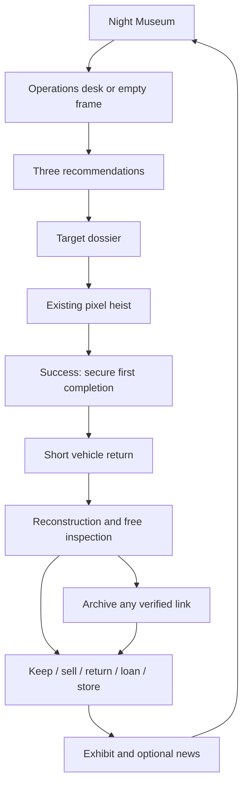

# Pixel Heist — The Missing Inventory

**Canonical English game, story, progression, and screen design**

Document: `PH-DESIGN` · Revision: `2026-09-23-r12` · Language: `en`  
Date: 20 September 2026  
Companion: [Turkish design](10-pixel-heist-oyun-cercevesi-ve-ekranlar.md)  
Implementation: [ToDoList.md](../ToDoList.md) / [Turkish checklist](../ToDoList.tr.md)

This is the authoritative design for AI-assisted implementation, not a claim that these features exist. Read this file before implementing a phase. Latest explicit user instructions take precedence; update this file and the Turkish companion together. Earlier numbered design notes describe the demo's history and must not override this revision.

## 1. Product promise and agreed direction

**Choose the art you want to steal, build your own Night Museum, and discover an inventory someone is trying to erase. Your collection tells the story of the thief you become.**

The two continuing questions are: “What do I want to steal next?” and “What is my place in this object's story?”

The user has confirmed a mysterious, stylish, witty heist adventure; a long campaign with a definite ending; purchasable packs; personal moments worth sharing; and the possibility of optional rewarded ads. Wealth, fame, research, and collecting must involve meaningful trade-offs. Launch languages are English, Turkish, Spanish, and German.

The proposed scope is **five acts, 20 levels, five main heists per level: 100 main heists**. Each level contains six selectable targets and one fixed finale target. Choose four of the six, then complete the finale. This requires **140 distinct artworks**, leaving **40 optional completion heists** after the story. Counts and duration are design targets, not measured results or individually user-specified numbers.

The museum preserves taste, decisions, first jobs, difficult jobs, regrets, and public reactions. The puzzle remains the existing color-and-slot game. Target selection, short travel, reconstruction, collection decisions, and story provide the new adventure layer.

Baseline commercial proposal: free main campaign, clear permanent cosmetic packs, one optional rewarded-ad placement, and potential standalone paid adventures later. Prices, audience rating, shipping platforms, SDK vendors, and live operations budget remain production decisions. Current work is phased implementation with local test boundaries; no live-commerce integration is enabled.

## 2. Critique of the original ideas

| Initial idea | What to preserve | Stronger design |
| --- | --- | --- |
| Monetary, fame, and artistic values | Different reasons to choose an object | Independent offer, public recognition, research relevance, and contextual collection fit; no total quality score |
| A numerical artistic value | Interest in art and history | Explain cultural importance through facts; score a specific collection relationship only when meaningful |
| Three to five developing traits | A personal thief identity | Four paths matching target motivations: Wealth, Renown, Research, Collecting |
| Sell unwanted works | Economic consequence | Inspect first; keep, sell, return, or loan; archive clues independently of ownership |
| First job / masterpiece / hardest job | Attachment | A few earned or player-chosen memory labels, not identical praise on every object |
| Collectible news | A world that reacts | Authored headlines at meaningful events, multiple viewpoints, optional archival collection |
| Theft benefits humanity | A larger purpose | Benefit comes from evidence, access, and restitution; keeping or selling can still be morally complicated |
| Search each object for a clue | Curiosity after a heist | Inspect everything; only five fixed works contain main archive fragments; other works have distinct personal or research value |
| Purchases and rewarded advertising | Fund the game | Sell a personal museum and crew identity; optional ads grant decoration credits, not relief from a deliberately frustrating puzzle |
| Sharing | Express identity | Personal headlines, five-work exhibitions, and short satisfying heist clips |

A high offer must not automatically mean high fame, research value, and collection fit. No candidate should dominate all meaningful outcomes in its recommendation set. Choosing four of six targets creates an opportunity cost before the finale; otherwise choice would merely change the order of mandatory chores.

## 3. Preserved puzzle contract

- Choose a front color carrier, rather than tapping individual pixels. A valid carrier may enter **any empty active dock**; its own column is only a preferred destination.
- Scouts collect matching, reachable, unreserved pixels. They never cross filled pixels. They approach through empty space from the closest permitted frame entry and return to their originating carrier.
- A real artwork color that is currently sealed inside remains selectable. Its carrier waits with folded rotors until a scout actually starts working.
- Some rear packets show a neutral question mark. Their true color and capacity are revealed upon reaching the selectable front row; undo never rerolls them.
- Only colors absent from the original artwork have expiry bars. These packets cannot be selected and leave the queue when their timers expire. Real colors never expire, including temporarily inaccessible ones.
- Levels 1–2 retain three lanes/docks; Level 3 has five and **bottom-only entry**. Later layouts use up to five docks and authored combinations of existing rules. No chase, reflex, or new mandatory investigation minigame.
- **Base pace (2026-09-23 decision):** the simulation runs at twice the original demo pace. The “1×” label names this base; 3× multiplies it. Decoy expiry uses the same base, so timer-versus-flight relationships are unchanged at 1×.
- Scouts are visually substantial and calm by default. Departures are spaced; magnetic pickup visibly lifts a pixel. A carrier opens rotors only when its first scout starts. Upon final delivery, its dock frees and the empty carrier rises toward the camera and exits left or right.
- Automatic 3× engages when every occupied carrier is actually working, provided time remains. Empty docks and queued packets do not prevent it. Waiting carriers or a new deployment stop automatic acceleration; manually selected 3× is preserved according to existing behavior. **Disabled 2026-09-25 (Halil):** the shipped game no longer switches to 3× on its own; 3× starts only when the player taps it. The rule stays in code and under automated tests.
- Retain the existing **600 real seconds of shared 3× time**. It counts down only during active 3× gameplay, never in menus, ads, modals, or travel. Zero forces 1×. Undo, restart and profile growth do not refill it. **Refill (2026-09-23 decision, provisional):** only when it is empty, tapping 3× offers 120 more seconds for 240 earned credits. The purchase is a durable, idempotent ledger event; it never uses real money or ads, never reduces Wealth, and each refill starts a new monotonic budget epoch. Revisit the price and amount after observed full-campaign play.
- Undo, pause, and restart remain free. Failure consumes no energy or entry ticket. Decoy timers are not accelerated by 3×.
- Preserve quiet rotor ambience, light tension music, and fine, soft magnetic ASMR pickup sounds. Sound, music, and reduced motion remain controllable.

Story and commerce must not cover the artwork, queue, or decisions. The player can skip presentation while retaining rewards and progression.

## 4. Campaign, jobs, artworks, and museum floors

| Term | Definition | Proposed amount |
| --- | --- | --- |
| Level | A story case and authored difficulty package | 20, grouped into five acts |
| Main heist | One artwork puzzle | Five per level; 100 total |
| Candidate artwork | Distinct collectible catalog object | Seven per level; 140 total |
| Museum floor | Player-arranged exhibition space | Ten floors with five positions each |

Museum floors are independent of levels: a Level 7 object can be displayed on Floor 1. Use localized “Level” labels in operations and “Floor” labels in the museum.

### A level's sequence

1. Open a case with six selectable candidates. Recommend three different motivations; “Other targets” reveals the remaining candidates without payment.
2. Choose a target; complete heist, return, inspection, and disposition.
3. Repeat for four distinct selectable targets. Four shared story beats advance as jobs finish.
4. Reveal the fixed finale target and its importance. Initially its identity is unknown.
5. Complete the fifth job to open the next level. The two unchosen candidates remain for post-story completion.

Six candidates taken four at a time in order produce 360 sequences. Write four shared beats and fixed per-artwork side results, not 360 campaigns. Dialogue can shorten if information is already known. Clues never move between artworks to match the player's choice. A shared beat can arrive through a contact or research message; it need not be hidden in whichever object was just stolen.

Catalog arithmetic: 80 selected jobs + 20 finales = 100 main jobs; 20 × 7 = 140 artworks; 20 × 2 = 40 remaining jobs. Replays do not create duplicate objects, sales, or profile gains.

The existing demo has 15 works across three levels. Retain them; add two candidates to each of those levels, producing 21 candidates for the initial expanded slice. Preserve the all-unlocked demo as a separate progression mode. Existing ownership must survive migration without pretending that skipped story beats were experienced.

### Content and duration budget

Provisional catalog mix: **84 recognizable real-art interpretations and 56 fictional works**. The complete 140-name catalog still needs production; this document does not pretend that it is finished. Relative to the current 15 works, the target requires **125 additional artworks**.

Aim for four to seven minutes per heist and 20–45 seconds of required post-heist interaction. A hundred jobs produce about 7–13 hours of basic flow; target selection, story, and museum decisions bring the main journey toward **10–16 hours**. Completion jobs and exhibitions may bring the total toward **14–22 hours**. These are unmeasured targets; skipping story may shorten playtime.

At roughly 30 minutes on five days a week, the main story can span **four to seven weeks**. This is an example habit, not a calendar gate. Players can continue immediately: no energy refill, next-day unlock, ad requirement, or missing future content blocks the main ending.

Do not lengthen the game by slowing drones, repeating mandatory artworks, or extending travel. Validate one complete level before scaling production.

## 5. Story: The Missing Inventory

### Opening and secret

Ada “Pixel” Vale takes jobs for money and recognition. Her technical partner, Milo Reed, has adapted a pixel-transfer device that can safely separate art into transportable pieces. Neither fully understands its origins.

An anonymous client, **the Curator**, orders selected pieces from Victor Voss's private collection. At the end of Level 1, Ada discovers that her own device is also on the delivery inventory. She breaks the final delivery instruction and redirects the works to the Night Museum. This is the inciting incident, not the final revelation.

Years earlier, a restoration network altered ownership histories for objects taken from dispersed archives, confiscated collections, and museum storage. Voss finances the visible operation through the fictional **Atlas Foundation**, which presents itself as a preservation service while erasing inconvenient histories.

Restorer **Mara Bell** saved original records. She divided the inventory into five small archives, concealed in later conservation layers or supports of five specific objects. She did not make real historical artists hide secret messages. Damaged shipment lists, changed labels, and transferred conservation pieces now obscure the carriers' identities. The Curator has a broad, imperfect candidate list.

The inventory records lost ownership, altered transfers, authorizations, beneficiaries, and destruction instructions. It is evidence, not a treasure map.

### Why steal and reconstruct the whole object?

Within this fictional world, Milo's device distinguishes an object's surface, support, and added conservation materials only after full transfer and reconstruction. A normal photograph cannot reveal those relationships; partial transfer cannot authenticate the mark. Explain this once through an example. It is an invented premise, not a scientific claim.

### Client, motive, and human stakes

The Curator is **Evelyn Vey**, a former cultural-asset researcher. She knows real wrongdoing occurred, but wants the archive and device under her own control so she can decide where objects belong. Her information is partly true; her claim to protect everything conceals an appetite for authority.

Evelyn: “Under one roof, they would be safe.” Ada: “And only you get the key.”

Ada begins with debt, ambition, and the need to protect her device. Over time she must confront whether her own museum is becoming another Voss collection. Players may still value money, beauty, collecting, or fame. No disposition is automatically treated as heroic.

The human benefit comes from recovered records, verified returns, public access, and exposing falsification. The wrong sale or renewed concealment can create another loss. Journalist **Nora Quinn** checks claims; community testimony matters alongside digital evidence.

All criminal owners and institutions are fictional. Real artists and museums are not accused of involvement. A real artwork's museum record is presented separately from its alternate-fiction mission location.

### Cast and voice

| Character | Want and conflict | Presentation |
| --- | --- | --- |
| Ada “Pixel” Vale | Freedom and recognition; can confuse possession with protection | First-person viewpoint, concise dialogue, choices reflected in the museum |
| Milo Reed | Protect the device and understand it; sometimes values technical achievement over consequences | Briefings, van exchanges, inspections |
| Nora Quinn | Find and verify an erased history | News, records, evidence links |
| Evelyn Vey / the Curator | Control the archive and its distribution | Coded messages, later direct negotiations |
| Victor Voss | Protect status and his identity as a collector | Statements, private collections, final confrontation |
| Robin Shaw | Keep the museum alive; challenge Ada's taste and excuses | Exhibition help, warm observational humor |
| Mara Bell | Deceased restorer who preserved the original inventory | Fixed archival evidence and the device's history |

Introduce Ada and Milo first, then the client, Nora, and Robin. The central hook is: **“Seven works on the list. Why won't the client say which one matters?”** Reveal the larger human stakes gradually.

Style comes from night cities, careful framing, short notes, clear typography, and confident characters. Humor comes from taste meeting practical trouble; victims and restitution are not punchlines.

- Milo: “The client asked for something small.” Ada: “They meant the budget.”
- Robin: “That wall is missing something.” Ada: “A museum somewhere agrees.”
- Milo: “You left the frame?” Ada: “I respect their decorating choices.”

Dialogue should feel natural in each language, not advertise social sharing.

## 6. Five acts and twenty levels

Every level uses four of six selectable targets plus one fixed finale. New finale titles below are fictional unless explicitly identified as existing real-art interpretations.

| Level | Case / atmosphere | Finale target | Story result | Puzzle emphasis |
| --- | --- | --- | --- | --- |
| 1 | First Commission — Voss's sample collection | Moon Gate Mask; existing fiction | Device appears on the order; Ada redirects delivery | Three docks, access, safe waiting |
| 2 | False Owners — private European exhibitions | Water Lilies; existing interpretation | Fragment 1; label and history conflict | Small payloads, mysteries, decoys |
| 3 | Lower Threshold — Paris restoration chain | Apples and Oranges; existing interpretation | Detect a copied mark | Five docks, bottom-only access, sealed colors |
| 4 | Harbor Collection — fictional Istanbul depots | Shore Ledger | Confirm Atlas's shipping link; choose an independent direction | Disjoint shapes, narrow openings |
| 5 | Wrong Address — transport collection | Return Ticket | Separate a misleading label from the true shipment route | Shorter, flowing queue-reading job |
| 6 | Sealed Shipment — harbor archive | Blue Shipping Plate | Fragment 2; establish the transfer network | Opening inner colors |
| 7 | Silent Auction — private Vienna invitation | Gold-Faced Clock | Identify the buyers' influence and the Curator's old signature | Distinguishable close hues, queue planning |
| 8 | Unsigned Letter — exhibition designer's storage | Half an Invitation | Nora verifies the signature; Ada sets terms | Familiar-rule act closure |
| 9 | Two Collections — Amsterdam salons | Double-Labeled Landscape | Prove one ownership record was assigned to two objects | Islands, spare-dock planning |
| 10 | Double Entry — restoration archive | Twice-Written Portrait | Fragment 3; Evelyn reveals herself and her intention | Consequences of choosing inner colors early |
| 11 | Missing Voices — family/community archive | Entrusted Chest | Connect records to living people and a significant return | Calmer color groups |
| 12 | Open Door — closed exhibition depot | Exhibition No. 12 | First major independent exhibition reflects earlier choices | Moderate, flowing closure |
| 13 | Polite Threat — Atlas invitation | Silver Card Case | Voss attacks Ada through the press; document the source | Mystery packets and planning |
| 14 | Whose Story? — publisher's collection | Before the Press | Verify how testimony was altered | Shorter breathing space |
| 15 | Pressure After Dark — closed exhibition | Closed Window | Fragment 4; identify beneficiaries; museum choices become public | Existing edge rules plus mysteries |
| 16 | The Cost of Trust — preservation network | Three-Key Box | Establish a practical alternative to Evelyn's central control | Planned act closure |
| 17 | Missing Page — moving Atlas archive | Cut Album | Narrow fixed candidates for the last archive; discover destruction order | Inner colors and passages |
| 18 | Last Offer — Voss's negotiating room | Untitled Bust | Offer of silence; contacts react to Ada's history | Short, definite decisions before the climax |
| 19 | Final Inventory — private showcase | Study No. 0 | Verify the device's origin in Mara's work; locate last target | Mastery of familiar rules |
| 20 | Whose Museum? — Voss's principal collection | Night Atlas; large fictional mosaic | Fragment 5, complete archive, final disposition and personal exhibition | Authored final queue, no new mechanic |

Main fragments are fixed in the finales of **Levels 2, 6, 10, 15, and 20**. Other finales provide verification, location, relationships, or consequence. Not every job discovers another fragment.

| Act | Levels / jobs | Evolving purpose | Payoff |
| --- | --- | --- | --- |
| I — Commission to Suspicion | 1–4 / 20 | Protect the device and question the client | First fragment, personal museum, independent objective |
| II — Following the Collection | 5–8 / 20 | Connect the movement of objects | Second fragment, verified signature, changed client relationship |
| III — Whose Past? | 9–12 / 20 | Understand the people in the records | Third fragment, Evelyn's identity, major personal exhibition |
| IV — Against the Night | 13–16 / 20 | Defend the account and build allies | Fourth fragment, consequential press, alternative custody network |
| V — The Last Job | 17–20 / 20 | Complete the evidence and decide what the museum represents | Complete archive, explained device, definite ending |

Every fifth job resolves a small case; every fourth level pays off an act. Alternate demanding and flowing jobs. Each act needs a different place, collection theme, and relationship change. Rewrite or remove a level if its removal changes nothing. A three-sentence “Last night” recap supports returning players. P02 implements mid-heist resume, including in-flight pickup/delivery and undo; P04 preserves separate demo/story sessions. P05 adds a returning-player recap and resumes pending inspection or finale presentation before another job.

Retain all 15 existing works and their first three finales. Add two candidates per level without letting new opening targets skip the tutorial. Existing demo ownership survives independently of story completion.

### Ending and continuation

Three final approaches remain available regardless of profile:

1. **Open Inventory:** publish verified records, including those that expose Ada to criticism.
2. **Custodian Network:** entrust the record to independent researchers and community representatives with shared responsibility.
3. **Final Bargain:** use the archive to break Voss and Evelyn's power through a more private and controversial agreement.

The final choice governs the archive; previous sales, returns, retention, and disclosures still determine people, headlines, and the museum's appearance. The ending explains the fragments, client, device, and Atlas conflict. These answers are never withheld for a paid expansion.

The remaining 40 works become relaxed closure jobs. Standalone later adventures may use the same cast without undoing the ending or claiming the base story was incomplete.

## 7. Artwork categories and independent target values

### Categories

Paintings include portraits, landscapes, everyday scenes, still lifes, and abstract interpretations. Objects include ceramics, small sculpture, masks, jewelry, and clocks. Records include ledgers, maps, prints, letters, and small archives. All use the existing 2D pixel surface or silhouette; do not rely on tiny readable text within a puzzle.

Period, region, material, subject, and story tags cross categories. Themes such as water, night, travel, faces, gold, or ceramics support exhibitions beyond collecting a single artist.

### Four separate decision inputs

- **Expected offer if sold:** a fictional credit range, not guaranteed income for keeping the object.
- **Public recognition:** a fixed 1–5 indication of how widely the artwork is known; affects news and the thief's renown, not puzzle difficulty.
- **Collection fit:** specific to the player's exhibition, such as completing a three-piece theme; also show a potential theme when the museum is empty.
- **Research relevance:** none/possible/strong, with an authored reason. Never a fake clue probability or guaranteed main fragment.

Difficulty and permitted entry edges are displayed separately. Cultural importance gets factual context under “Why it matters,” not an objective artistic-quality score. Actual offers and estimated ranges are distinct, and all credit offers are explicitly fictional.

**Do not derive one axis from another.** Specialist demand can produce an expensive unknown object. A famous work can have a modest buyer offer in this fictional operation. Research comes from a fixed record; collection fit comes from the player's current display. Do not silently alter values to manufacture a balanced choice.

### Four example candidates, three visible recommendations

All names and amounts here are fictional design examples. They illustrate four motivations; the UI still shows three recommendations from the six available candidates, with free access to the others.

| Candidate | Expected offer if sold | Recognition | Research | Current collection fit | Opportunity cost |
| --- | --- | --- | --- | --- | --- |
| **Night Chronometer** | 12,000–14,000 credits | 1/5 | Weak; no verified side link | Weak | Choose money over a major headline, research lead, or completed exhibition |
| **Red Harbor** | 2,800–3,200 credits | 5/5 | Weak | Weak | Choose fame over a large sale |
| **Restorer's Notebook** | 1,500–1,800 credits | 1/5 | Strong; fixed Atlas workshop record | Starts Workshop Memory; does not complete the current exhibit | Choose investigation over money, recognition, and immediate exhibition completion |
| **İznik Bowl** | 4,000–4,200 credits | 2/5 | Weak; a shipping stamp alone is not evidence | Completes Roads and Motifs | Keep it and give up sale proceeds; defer the stronger research candidate |

Use comparable difficulty and expected duration for this demonstration. Explain the chronometer's specialist buyer and Red Harbor's limited operation-specific buyer budget without implying a rule about the real art market.

Show a concise benefit and sacrificed opportunity, grounded in other available candidates. A missed opportunity is not a deduction from already-earned stats. “Become rich, famous, a researcher, or a collector” describes changing preferences, not locked classes.

Only four of six works are taken before the finale, so the player cannot obtain every opportunity at the same moment. Later completion does not retroactively rewrite campaign reactions.

### Authoring and recommendation checks

1. Each level's six candidates must include high-offer/low-recognition, low-offer/high-recognition, and low-money/strong-research examples. Provide links to multiple exhibition themes.
2. In a suggested trio, each target should have at least one meaningful strength and sacrifice relative to another. Warn on contextual dominance; a token 100-credit difference is not sufficient balancing.
3. Definite offer superiority requires one range's minimum to exceed the other's maximum. Internal research/fit ordering may support validation, but never becomes a public universal art score.
4. Neither positive nor negative correlation is mandatory for every work. Values are authored independently with reasons; a mechanically random matrix is not the goal.
5. Empty collections get potential-theme information. If no well-differentiated trio remains, show honest candidates; do not invent bonuses. Show fewer when fewer are available.
6. Every first inspection is free. Main clues remain in fixed finales. All four motivations can finish the campaign.
7. Cosmetic purchases, ads, and sharing never improve recommendation priority or these four target values.

Do not show a best-overall badge, certain clue percentage, a duplicate fame stat on the target, puzzle solution, or real-time expiring target offer.

### P04 implementation boundary

The first case now uses Sun Seal, Sapphire Cup, Girl with a Pearl Earring, The Starry Night, Ivory Travel Clock and Workshop Swatches as its six selectable targets; Moon Gate Mask remains the fixed finale. The new clock (12,000–14,000 credits, recognition 1/5, no verified research link) and swatches (1,200–1,600, recognition 1/5, a fixed workshop side record) supply independent motivations alongside the familiar portraits/night scene (recognition 5/5, modest offers). These are fictional operation-specific offers. Full authored values and source files are in [Campaign.md](Campaign.md).

Collection fit counts owned originals physically displayed on the selected frame's floor. One matching original extends a theme; two let the target complete a three-work theme. Memory exhibits, other floors and purchased themes do not count. A departed original cannot promise repeat-sale proceeds. Meaningful money differences require a non-overlapping gap of at least 500 credits or 5% of the other range's maximum, whichever is greater. Recommendations compare sets for real strengths and sacrifices; they never assign a universal artwork score or modify authored values.

A completion transaction records ordered distinct choices and their shared beats, the two deferred IDs after choice four, and the fixed finale's unlock/completion. Replays cannot add another choice or restore a departed original. The existing 15-work demo and its saves remain intact, with a separate story session over 17 available puzzle definitions. The story gallery temporarily exposes four five-frame floors so new works have display space; the ten-floor production museum remains P07. Only the first case is authored/playable in this build. Later case headings explain unavailable content; they do not imply 20 completed cases. P05 implements post-heist inspection/disposition and authored buyer offers. P06 implements the 120-credit first-story-job fee, four independent paths, personal memories and earned-credit decoration catalog. Remaining authored cases/closure jobs remain P11/P12; only the first case has an actual reward-distribution simulation.

## 8. Four development paths

Use **Wealth (`wealth`), Renown (`renown`), Research (`insight`), Collecting (`curation`)**. These replace the earlier Mastery/Observation/Curation/Influence bar proposal. Do not implement both systems.

| Path | Growth | Visible reward | Trade-off |
| --- | --- | --- | --- |
| Wealth | First-job payments and first sales | Decoration budget, wealth portrait, titles | Selling removes the physical exhibit |
| Renown | Recognized first heists and authored visibility events | Wider press, character reactions, profile presentation | Fame may bring little money or collection fit |
| Research | Relevant first inspections and verified side cases | Context, research notes, side conversations | Less public attention or income |
| Collecting | First meaningful physical exhibitions and diversity milestones | Exhibition narratives and museum presentation | Keeping forfeits sale proceeds |

Wealth progression records lifetime eligible gameplay earnings; spending does not reduce it. The spendable wallet is separate. Ad credits, purchased packs, and test grants do not count toward professional Wealth. Real money does not directly buy credits. Recognition belongs to the artwork; Renown records Ada's history. Contact trust is a per-contact relationship state, not a fifth Influence bar.

Mastery survives as job achievements and eligibility for the **My Masterpiece** memory. The first completed authored `masterwork_eligible` difficult job can unlock the label. No timing record, perfect run, or separate XP tree is required.

Each path has five localized narrative ranks. The P06 first-case thresholds are Wealth 0/600/6,000/30,000/90,000; Renown 0/30/150/500/1,200; Research 0/8/40/120/250; Collecting 0/15/40/90/150. These are implemented starting values, not final 100-job tuning. Job dossiers and disposition show when guaranteed payments and conditional growth occur. Final thresholds require authored P11/P12 reward distributions and observed P08/P13 playtests.

P06 grants 120 lifetime Wealth per first story fee, plus the exact confirmed authored sale income. A first story heist grants 10 Renown per recognition level. First verified inspection gives 12 Research for a related record, 8 for a discrepancy, 25 for a main fragment, and zero for no evidence. Public sale/verified return/loan give 8/6/5 Renown and separate per-contact trust. Three same-theme originals on one floor give 20 Collecting once per theme across the save; three physical originals spanning four tags give 15 once. Historical grants survive removal; photos never count. The five existing bottom-entry demo jobs are explicitly `masterwork_eligible`. See [Economy.md](Economy.md) for event IDs, tuning, simulations and compatibility.

Use stable event IDs for one-time grants. Replaying, undoing, moving objects, re-saving news, or resale loops never duplicate growth. Selling after a completed exhibition preserves its historic milestone but removes its current physical completeness; rebuilding it earns no second reward. Memory displays cannot satisfy physical-object requirements.

No path grants extra docks, faster drones, early mystery colors, or an auto-solver. None gates main-story progress or endings. Profiles such as “Quiet Researcher” or “Headline Thief” reflect recorded choices, not generic praise. Maximizing all paths is not a completion requirement.

## 9. Keep, sell, return, or loan

Finish the free automatic first inspection before offering disposition. Keep for the physical collection; sell for credits and a buyer relationship; return for a verified recipient's trust, letter, or news; loan for an exhibition relationship and occasional distinct decoration. Each has a consequence, not an interchangeable reward total.

Return is available only when a recipient or institution has been verified. Offer two or three fictional buyers with different access intentions and prices. Do not provide real trafficking instructions.

Clues remain archived after sale or return, including main-finale evidence. Use one clear consequence confirmation for these meaningful decisions, not confirmations for routine navigation. “Store for now” always permits continuing. A replay cannot duplicate the object. If reacquisition is supported later, it is a defined one-time event without profitable sale loops.

Separate **ever acquired**, **current physical ownership**, and **displayed memory**. A departed object can leave a clearly labeled photo/pixel record: returned, on loan, or left the collection. This is not another original. Players may empty the frame instead.

Credits fund lighting, walls, frames, vehicle appearance, workroom decoration, and presentation. P06 ships six earned looks: three vehicle finishes at 120/240/600 credits and three diorama platforms at 1,200/3,600/7,200. Preview is free; purchase deducts the wallet and equips the look atomically. The first 120-credit job buys a visible van finish without selling or watching an ad. Full museum decoration follows in P07/P09. First-job base payment lets keep/return players earn something. High-value sales accelerate decoration but never puzzle power. Main story access is free of payment requirements.

Ten floors provide 50 physical display positions; storage accommodates all 140 base works and later add-on objects. There is no forced sale from a storage cap. Players rotate exhibitions rather than needing a floor for every level.

P07 makes those ten floors independent stable-ID spaces in both demo and story modes. Tap a work then a position, or drag onto the same five position controls. Replacing a display stores the previous original; emptying a frame stays empty. Seven optional themes show matching physical originals, current completeness and the save-wide first exhibition milestone separately. Rebuilding never pays again. Sold/returned/loaned records are visibly labeled memories. Local authored loans can be recalled immediately to storage; there is no invented real-time loan schedule, and recall cannot repeat trust or path rewards. Room detail can be switched between full and light without changing collection rules.

## 10. Personal labels and memories

Store first completion, fictional location, date, and subsequent disposition per object. Display sparingly.

| Label | Rule |
| --- | --- |
| My First Job | First completed heist in the save; never changed by replay |
| My First Big Job | First authored high-recognition target |
| My Masterpiece | Unlocked by a qualifying difficult first completion; player selects an eligible work |
| My Hardest Job | Player's subjective choice, not inferred as punishment for undoing |
| My First Return | First return, retained as a memory after the original leaves |
| My Overlooked Favorite | A personal favorite among lesser-known works |

Pin at most three jobs on the profile and show one primary label on each artwork card. Labels confer no money multiplier or puzzle advantage. Historical labels survive disposition. P06 makes first-job, first-big-job (recognition at least 4/5), and first-return labels automatic and immovable; the three subjective labels can move between eligible acquired works. Overlooked Favorite requires recognition at most 2/5. Profile shows the separate wallet, four ranks, individual contact trust, a call sign up to 24 characters and several compatible descriptions derived from recorded choices. Legacy unknown completion dates remain unknown; no first-job history is fabricated.

## 11. News and press album

News can come from a sensational paper, an art critic, a community voice, or Voss's office. It does not universally applaud Ada. Trigger meaningful coverage at first heists, famous targets, level finales, significant disposition, exhibitions, and major revelations—not every packet or purchase.

A card contains a fictional outlet, date, image, headline, two or three short paragraphs, and optional “Add to album.” Use a small museum notification rather than another mandatory post-heist modal.

Sample headlines: “The frame stayed. Everything inside left.” “Is Pixel building a collection or finding an archive?” “The box came home. So did our family's name.” “Why does public heritage live in her basement?”

Select authored variants using recognition, disposition, and story state. Runtime generative AI is not required. Initially budget 20 finale articles, about 25 event/decision articles, and limited named-artwork templates.

Reading and collecting are optional. Skipped articles remain in the archive, never expire, and grant no repeat rewards. The album supports a cover, dividers, and three featured clippings. Removing a saved clipping does not delete history. P07 implements nine first-case/available-content articles with deterministic one-time triggers, four fictional editorial voices, read state, optional saving, editable album cover/dividers and at most three featured saved clippings. The full campaign article budget remains P12. Private case-file notes stay local, are limited to 4,000 characters and never become evidence, article text or rewards.

## 12. Complete heist loop

The last scout returns to its carrier; the completed work is secured before presentation. Brief drone/pixel confetti leads to a cream-colored night-service van crossing a city-themed background. It is not driven by the player. At the loading bay, pieces reconstruct the artwork over one or two seconds and Milo reports inspection.

Aim for six to nine seconds on first viewing and three to five on repeats. Skip safely; reduced motion uses short transitions and a still completed object. Pause the 3× budget throughout. Text waits for input when needed; never erase unread dialogue solely to meet a duration target. Use at most two short bubbles per transition.

Examples: “The client didn't ask for this.” / “I did.”; “Right color. Early choice.”; “That's not the artist's mark.” / “Someone added it later.”; “There's a fortune in the van.” / “Then watch the potholes.”; “The frame is empty.” / “Its story isn't.”

### P05 implementation boundary

The first authored case now follows secured success → skippable city return → free inspection → one confirmed disposition or Store for now → museum. A first story completion commits its 120-credit job fee, selected display frame, pending stage and queued optional notice atomically. Replay cannot pay the job fee again. The success view reports the recorded fee, never the estimated sale price. Text waits for input; presentation and menus consume no boost. Optional notifications do not automatically open modals.

`data/post_heist.json` fixes all inspection outcomes and eligible fictional recipients. Workshop Swatches supplies a side record, Moon Gate Mask supplies the client's device-delivery discrepancy without a main fragment, and Water Lilies remains the fixed `archive_01` carrier in the available demo content. Other works may yield no new evidence. Inspection archives verified results before disposition; selling, returning or lending never deletes them. Legacy inspections upgrade through a separate idempotent authored-evidence transaction. The two fictional buyer offers pay only on confirmed sale; their current values are checked by P06 first-case simulations, with full-campaign tuning remaining open. Keep exhibits the original when an implemented museum frame is available; Store for now preserves ownership in storage. Re-exhibition is placement and grants nothing. P06 adds buyer trust, independent path grants and profiles. P07 now supplies full museum placement and immediate local loan recall; any future timed loan schedule requires a separate design decision.

Twenty editable screen shells and an editable shared modal surface establish routing, back actions, long-content regions and loading/empty/error presentations. P05 supplies entrance, return, reconstruction, disposition and case-final recap plus minimal archive/storage readers; existing heist, selection and museum controllers remain in use. Future news, commerce and sharing shells do not imply their providers or content exist. The S18 presentation uses actual displayed originals/memories and empty positions, but its production route remains locked until the base-campaign ending is authored in P12. P05 is not the complete campaign ending.

The production heist now uses beveled instanced 3D tiles, a recessed tray, volumetric crew, folded waiting rotors, lifted magnetic payloads and zero-capacity takeoff. A fixed orthographic projection aligns with existing 2D hit areas and routes. Original puzzle state, entry rules and timing remain authoritative; visual callbacks cannot pick a tile or grant rewards. Entrance, city return and success share original night dioramas, with immediate input and reduced-motion variants. P07 now supplies perspective museum traversal; real-device costs remain P13.

## 13. Screens and contents

Four primary destinations: **Museum, Jobs, Case File, Profile**. News lives in the museum/profile. Packs live in the Workshop. Sharing starts from a specific memory. Do not turn every subsystem into a main tab.

### S01 — Start / continue

Logo, a detail from the player's museum, “Continue the night,” “Visit museum,” settings, and a resume card such as “Level 4 · 2/5 jobs.” New saves show “Start your first job.” Demo selection stays separate. Returning players get the short recap; opening the game does not stack sale, news, and profile pop-ups.

Visual requirement: a dimensional logo and animated night-heist diorama with one signature drone; keep the primary action immediately usable. See section 16.

### S02 — Night Museum

First-person horizontal movement, five frames per floor, elevators at both ends, floor and exhibition names. No visible thief avatar. Occupied frames open details. Empty frames offer “Find a new work” or “Place from storage.” Physical and memory displays are distinguishable; the collection detail separates original objects from records.

Visual requirement: perspective room depth and first-person camera travel/approach, not only a sliding flat wall; preserve frame selection and elevator flow.

### S03 — Operations desk

Twenty case cards grouped into five acts; four selectable-job markers and one finale, a short next-question hook, and deferred targets. Example: “Level 4 — Harbor Collection · Two selectable jobs left · Finale under investigation.” Unlocking requires the previous finale, not credits, stats, or album completion.

### S04 — Target recommendations

Three large cards with artwork, category, expected offer if sold, recognition, contextual fit, research note, and one difficulty/entry line. Include the meaningful benefit and sacrificed opportunity. “Open dossier” is primary; “Other targets” is free. Preserve the selected-frame context. Never display an unacquired work as already owned.

### S05 — Target dossier

Large image, fictional holder/location, offer, concise research reason, difficulty and edge restrictions. Real-art facts open separately. At most two brief bubbles and “Start heist.” No pre-inspection forced sale choice.

### S06 — Heist

Existing artwork/city header, speed and remaining boost, board, active docks, queue, undo/sound/help. (2026-09-25 layout: painted museum-hall background, gold frame hugging the painting with a title plaque, robot-ant scouts, undo/help/sound as small top buttons and a four-icon toolbar at the bottom whose functions are not yet defined.) No wallet, four-path dashboard, news badges, store, or mandatory story modal over play. Story notifications wait until completion.

### S07 — Pause / blocked state

Continue, restart, museum, sound/music/motion settings. If blocked, explain briefly and offer free undo/restart. No reputation loss, damaged-art penalty, or paid rescue. Saving/resuming later must preserve logical state without inventing progress.

### S08 — Success / delivery

Drone confetti, artwork name, completed pixels, secured base payment, and at most one new memory label. “Return to museum” stays primary. Optional “Make a memory” opens sharing; eligible rewarded-ad credits appear as a separate explicit choice after the base reward is saved. Do not auto-open all choices or repeat full progression summaries.

Visual requirement: an original dimensional completion badge and short artwork/drone-confetti choreography; normal and reduced-motion versions must preserve reward timing and early continuation.

### S09 — Night return

Short city-themed van transition, zero to two bubbles, skip. Vehicle cosmetics are visible. On crash or quit, resume at a safe pending-inspection state without replaying the heist or losing the work.

### S10 — Reconstruction / inspection

One- to two-second assembly, artwork name, “Inspection complete,” and one authored result: no archive trace plus useful art/collection context; related side record; main fragment with count; or inconsistent mark. No paid scanner, countdown, extra pixel-search minigame, or advertisement required. Actions: case file or disposition.

### S11 — Artwork's future

Keep, sell, return, loan, with concrete consequences and eligibility reasons. Buyer detail includes profile and offer. Confirm irreversible consequences once. “Store for now” never blocks the narrative.

### S12 — Artwork details

Three sections: Artwork (artist/date/type/importance/sources or explicit fiction label), My Job (first completion, place, memory, display and ownership), Case Link (already-known evidence only). Actions: exhibit, store, change label, eligible disposition, replay with clearly stated no-repeat-reward behavior.

### S13 — Missing Inventory case file

Five fragment positions, known people and links, one or two unresolved questions. Verified connections place automatically; reading and personal notes are optional. A brief known/unknown summary prevents confusion. No compulsory drag-and-connect deduction puzzle.

### S14 — Newsstand / album

New/read articles and saved clippings; filters for jobs, returns, Atlas, museum. Add, feature, remove. Unsaving does not erase the archive. No reward farming.

### S15 — Thief profile

Call sign, Wealth/Renown/Research/Collecting, three pinned jobs, and a concise choice-based portrait. Wallet appears separately. No duplicated public-fame bar or obsolete skill tree.

### S16 — Exhibition / storage

Themes, five positions, originals and memory records, and explanations of relationships. Support tap-then-place as well as dragging. Cosmetics do not change rewards. Stored art neither expires nor loses value. Current physical completeness differs from historical exhibition achievement.

### S17 — Level finale / next case

The chosen five works, two deferred candidates, main finding, character consequence, and “Open next case.” Returned works still count as completed jobs. Describe familiar rule combinations concisely; do not reset the story each level.

### S18 — Final choice / last exhibition

Completed archive, three approaches, clear consequence summary, final confirmation, then short personalized news. End in the player's actual museum arrangement, including returned or sold memories. “Continue collecting” opens closure jobs. The ending is complete without an expansion.

### S19 — Workshop / pack storefront

Separate “Credit decorations” and “Special packs.” Show exact contents, own-museum/drone/vehicle preview, ownership, and one platform-localized real price. Mark items pictured but not included. Preview never grants ownership or destroys the previous layout.

Purchase enters the platform flow; pending, success, cancellation, failure, and restore are distinct. One contextual invitation after an exhibition is enough; do not auto-open the store. No purchase button beside a story choice.

### S20 — Memory studio / share preview

Choose headline, exhibition card, or later clip; use actual work and labels with a small Pixel Heist signature. Save image and Share are distinct. Sharing opens a user-chosen destination, never sends automatically.

Ship still images first; retain a still fallback if later video generation fails. Default output excludes real names, private notes, purchases, and mystery solutions. The call sign is optional. The card must make sense without a functioning link.

## 14. One worked example

In Level 4, two jobs completed, the player wants a third Roads and Motifs exhibit.

1. An empty frame recommends Red Harbor, İznik Bowl, and Restorer's Notebook. Night Chronometer is accessible through other targets if still available.
2. Red Harbor offers greater recognition but a lower expected sale than the bowl. The notebook has the stronger research link. The player chooses the bowl to complete an exhibition.
3. At a fictional Atlas depot: “The label is new. The bowl isn't.” / “Let's bring the bowl home first.”
4. Play the unchanged puzzle. Choosing an inner blue early creates a waiting carrier; automatic 3× starts only when all occupied carriers are working and budget remains.
5. Secure last delivery, base payment, and brief celebration.
6. Return: “Did you leave room for it?” / “This time I planned ahead.”
7. The shipping stamp proves insufficient for a new research link. Report “No archive trace” and useful collection context; do not quietly give the strong investigation reward anyway.
8. Keep the bowl, forfeiting the sale; earn the first exhibition's Collecting milestone. If no recipient is verified, return remains unavailable.
9. Place it in the selected frame; explain its connection to the other works. Optionally label it My Overlooked Favorite.
10. An exhibition article may appear in the newsstand. Operations now shows “Level 4 · 3/5 jobs.” One selectable job and the finale remain.

Red Harbor would instead produce a larger press event with a modest offer; the notebook would give additional research context and a Nora conversation. The main finale remains reachable in every case.

## 15. Mystery continuity rules

1. Mara died years earlier; Ada cannot contact her for the list. The incomplete workshop record reached Evelyn after Mara's death.
2. Milo adapted an older preservation prototype rather than inventing every component. Its connection to Mara is verified in Level 19.
3. The five archives contain complementary record groups, not five meaningless password segments. Early fragments are useful before the whole is assembled.
4. Carrier artworks are fixed; sale value and player stats cannot relocate clues.
5. Side-target research may concern verification, not a main fragment. Do not promise a main key on every strong research card.
6. Nora's checking and people's testimony corroborate the archive; the device alone does not settle rightful ownership.
7. An already found fact is never withdrawn after an unrelated choice. An unchosen side scene is missed, not copied into an arbitrary new object.
8. Voss learns through press and contacts; he is not omniscient. Museum exposure is not a random raid timer.
9. Final approach and earlier disposition both matter. The last button does not erase the rest of the campaign.
10. Real art information is independently sourced and kept separate from fictional allegations or conspiracies.

## 16. Visual, sound, and reading rhythm

**Updated user direction:** a lively, playful, pop-culture heist world with three-dimensional-looking artwork pixels, scout drones, carrier boxes and collection rooms. The Night Museum must feel like moving inside a spatial room. A designed entrance, expressive completion sequence and game-specific modals are base-game requirements. The former restrained flat-panel treatment is superseded; the puzzle and story contracts remain.

Use rounded designer-toy materials, readable bevels and soft shadows, saturated cobalt/cyan/coral accents, warm spotlights and original comic/sticker motifs. Keep cream as a calm artwork surface and night ink as contrast, not the only visual identity. Authored task colors remain independent of lighting and interface decoration.

Keep the logical puzzle in 2D. Prototype 3D or convincing 2.5D presentation for tiles and crew, and a perspective room/camera for the museum. Camera travel stays controlled: corridor movement, artwork approach and elevators, with no visible thief or required free-camera game. P03 compares procedural 2.5D and real-time 3D against identical puzzle state, and selects real-time 3D board/crew plus a perspective museum for P05/P07. See [rendering decision](RenderingDecision.md) for measured desktop costs and the separate P13 device gate. P08 validates stills and motion before mass asset production.

S01 gets a dimensional logo, living night-heist diorama and a clear Play/Continue button. S08 gets last-delivery emphasis, artwork reveal, a success badge, drone pixel-confetti and soft resolved audio; skip and reduced motion remain. S18 celebrates inside the player's actual collection. Modals use an illustrated, tactile, dimensional component family with distinct dossier, framed-art, news, reward, settings and decision variants. Long content, four languages, focus/back behavior and truthful consequences remain readable.

Detailed materials, reference evidence, animation timing and acceptance: [VisualDirection.md](VisualDirection.md) / [Turkish](VisualDirection.tr.md). The research separates visually inspected local/Toon Blast/Match Factory material from publisher-described Royal Match/Royal Kingdom design. No competitor interaction or success flow is claimed to have been played.

Priority remains artwork/consequence in selection; board/docks/queue in play; personal layout in museum; known facts/open questions in the case file. Do not stack mandatory notifications. Store-and-continue stays available. Keep fine ASMR pickup, quiet rotors, optional music, readable text and reduced motion. Visual flight height never bypasses filled pixels, routes or bottom-only entry.

## 17. Production sequence and honest baseline

The existing Godot demo contains 15 works, three levels, five-dock bottom-entry Level 3, sealed-color waiting, mysteries, shared docks, timed/automatic speed, museum movement, art facts, versioned saves with mid-heist continuation, and celebration. It is not the complete campaign.

First build one end-to-end level with seven candidates: recommendations → puzzle → van → reconstruction/inspection → keep/sell/store → museum, with one label, news item, theme, and initial profile progression. Show one theme preview and share card before mass production.

| Milestone | Scope | Gate |
| --- | --- | --- |
| A — Complete loop | One level, seven candidates, five main jobs | Players explain why they selected an object |
| B — First three levels | 21 candidates, 15 main jobs | Choices do not force unwanted sales or repetition |
| C — First two acts | Eight levels, 56 candidates, 40 jobs | Collection and content variety hold |
| D — Middle story | 12 levels, 84 candidates, 60 jobs | Evelyn and human stakes develop without repeated exposition |
| E — Final conflict setup | 16 levels, 112 candidates, 80 jobs | Previous decisions appear in reactions |
| F — Complete story | 20 levels, 140 candidates, 100 jobs | All main routes and endings are coherent and save-safe |
| G — Completion | Remaining 40 jobs | Ownership and rewards remain consistent after the ending |

Prototype commerce using fake/sandbox adapters, never real purchases in tests. Later validate two packs and one ad placement. Extra packs, clips, and paid adventures follow evidence of interest.

Persist job completion, physical ownership, exhibition, clues, labels, path rewards, news, wallet, purchases, and ad rewards independently. Final delivery commits once before presentation. Skipping, quitting, restoring, or repeating inspection cannot duplicate a grant. Save migration retains the demo's data. Pack preview is not ownership; verified entitlements must survive application restarts.

P02 implements local stable-ID saves, non-destructive demo migration, atomic primary/mirror recovery, matched logical/visual/undo continuation and a separate monotonic boost record. Unknown or unrecoverable saves are preserved and locked rather than reset. Demo and story progress remain separate; the playable story campaign is still future work. See [persistence contract](Persistence.md) and [P02 evidence](P02-Implementation.md).

## 18. Playtest questions

- Are choices genuine, or does one offer dominate? Test all four motivations; change candidate context before adding more stats.
- Is the museum personal enough that players care about keeping a favorite or a returned object's empty frame?
- Does an inspection without a main clue still deliver an honest, useful result?
- Are travel and reconstruction tiresome by the fifth repetition? Shorten defaults where appropriate.
- Do the four paths create distinct identities beyond the wallet?
- Does the 600-second boost budget make the remaining campaign drag? Measure rather than selling a refill by default.
- Can 140 works each support recognizable art, sourced facts, a solvable queue, and a story role? Prove the first 21 before scaling. Cut weak duplication rather than filling a numerical quota.

## 19. Purchasable packs

Purchases should answer “Make my museum mine,” “Give my crew a signature,” or “Let me play a new adventure.” The first two are presentation; the third requires genuinely new content. The base campaign remains free under this proposal.

| Pack | Exact proposed contents | Reason to want it | Timing |
| --- | --- | --- | --- |
| **Night Signature** | One carrier/scout body style, matching van skin, one confetti style, one clipping border | A coherent crew and memory identity | First launch pair |
| **Art Deco Salon** | One wall pattern, three frames, two lighting looks, one exhibition-title design | Present personal art in an elegant room | First launch pair |
| **Bosphorus After Dark** | One Istanbul-inspired room theme, two frames, van skin, coastal return lighting | A favorite city atmosphere | Later theme |
| **Press Collector** | Three clipping layouts, two album covers, exhibition invitation design | Present the thief's history differently | If the album proves compelling |
| **Venice: Last Invitation** | Seven new candidates; four selected jobs and a finale; two closure jobs; new setting/news | A complete standalone adventure | After the base game |

Venice's works are additional to 140, not resold base closure jobs. All seven are playable after purchase without a second charge. Its mystery is independent; it does not contain the withheld real ending.

Cosmetics retain readable task colors and numbers; a blue skin cannot make a red carrier look like a blue target. Do not change capacity, speed, access, docks, or animation timing. Everyone gets a good free museum, clipping, and exhibition-card option. Do not sell personal achievement labels, main evidence, path XP, or original stolen artworks directly.

Contents are deterministic and visible: no random loot boxes. Prevent duplicate purchase of a permanent pack. Start with nonoverlapping bundles. Avoid expiring offers, fake discounts, and failure-triggered storefronts.

Use one earned currency, credits, and direct real-price purchases of defined permanent packs. No gems, keys, subscriptions, or purchasable credit wallet in the first release. Keep a worthwhile earned-credit decoration catalog. First jobs should fund an early meaningful free choice; tune actual prices after timing and reward measurement. Real currency prices remain undecided, not invented market estimates.

## 20. Optional rewarded ads

Start with one placement: **a first-completion success screen offering extra decoration credits after the base job reward is secured**. Example only: “Job payment: 100 credits — saved” and “Watch ad · +100 credits.” Return to museum remains primary. The ad bonus equals the base operation payment, not the sale, all rewards, or profile XP.

Initial test rules: no ad on the first heist; at most one bonus per first-completed job and two per UTC day. The cap is a tunable product proposal, not a platform rule. Skipping leaves no debt or persistent notification. Do not encourage chained viewing.

Offline, unavailable, loading failure, cancellation, and dismissal never block the base reward or main flow. Grant the bonus once from the provider's verified reward event, not merely from closing the ad. If a late event is verified after interruption, reconcile it on return. Pause gameplay, audio, and boost while ads are active; restore preferences afterward.

Do not require clicking or buying an advertised product. No ad in active color selection, blocked-state recovery, undo, clue reveal, return decision, or final dialogue. No forced interstitial or banner is proposed, so there is no initial Remove Ads pack. Keep 3× refill outside the current design; first validate the 1× experience.

## 21. Why players share

The hook is a personal choice, such as “I went for the bowl,” not only “I finished a level.” Never invent population claims such as “Everyone else chose the expensive painting.”

| Memory | Moment | Content | Curiosity for the viewer |
| --- | --- | --- | --- |
| Heist headline | Recognized job or personal milestone | “The frame stayed. The painting came with me.” plus actual artwork/location | How did you steal that? |
| My five works | A curated floor | Player's real five works, title, frames, lighting | Which five would I choose? |
| A frame's story | Return or sale | Accurate disposition label: “My favorite work is no longer here.” | Why give it up? |
| Final pixels | Completion | Later six- to eight-second pickup/assembly clip with soft sounds | Can I try that motion and sound? |

Start with still cards; clips are not required for 1.0. Later clips use actual recorded end-of-heist events without restarting the reward simulation or fabricating play. Have a still fallback.

Shareable story moments include call-sign headlines, named exhibitions, personal favorites, Ada–Milo exchanges, and final museum portraits. Default templates exclude Evelyn's identity, fragment locations, and the ending solution. Paid visuals may appear naturally but are never required for sharing.

Preview before save/share. Use a small game signature. Where supported, attach a validated artwork link to the share text. For an installed game it opens a safe art preview, not a locked mission or spoiler. Otherwise use a valid store/site destination; do not promise deferred deep-link behavior that has not been implemented.

No mandatory account, friend list, public museum server, or social feed is required. Do not reward sharing with credits or treat opening a share sheet as a confirmed external post. Never access contacts or send automatically. A card should work even without a link.

## 22. Validate commerce and sharing

Prototype one museum theme, one drone style, one clipping, and one ad offer. Evaluate museum return visits, exhibitions and favorites, own-artwork preview, purchased-style use, image saves/share-sheet opens, next-job continuation after ad offers, and free decoration progress.

If weak: improve collection choices before adding products; improve pack content before increasing prompts; personalize cards before rewarding sharing; reduce or remove disruptive ads rather than cutting base rewards; repair free pacing rather than selling relief. Interest in base closure jobs and feedback can inform whether to produce new adventures.

These are hypotheses, not revenue guarantees. Establish numerical success thresholds after an initial cohort and player interviews. Avoid collecting private note or message contents. Measure the intended action without claiming unknown downstream shares.

## 23. Global identity and localization

### Canonical names and migration aliases

| Stable character ID | Display name in all languages | Role | Previous name |
| --- | --- | --- | --- |
| `ada` | Ada “Pixel” Vale | Player thief | Ada “Piksel” Koral |
| `milo` | Milo Reed | Technical partner | Milo |
| `nora` | Nora Quinn | Journalist | Leyla Aras |
| `evelyn` | Evelyn Vey | Curator/client | Elin Vey |
| `victor` | Victor Voss | Atlas collector | Viktor Voss |
| `robin` | Robin Shaw | Exhibition designer | Narin |
| `mara` | Mara Bell | Deceased restorer | Sera Demir |

Preserve these names and the Pixel call sign across languages. Translate titles and dialogue. These are creative choices for international readability, not claims about nationality or family relationships. Preserve authentic place and art names such as İznik rather than erasing cultural specificity. P03 migrated runtime speaker identities and public labels to this cast while preserving actual artist/place identities.

### Languages and markets

Required launch catalogs: **English `en`, Turkish `tr`, Spanish `es`, German `de`**. English is the authoring source. Turkish design is a synchronized companion. The current demo, visual lab and first-case target flow have complete en/tr/es/de catalogs. Remaining campaign content and independent native-language editorial review are still P11/P13 work.

Offer supported device language initially, persistent manual selection, and English fallback. Language is independent of store country, price, purchase entitlement, and advertising availability. Store prices use the platform's localized price, not a language-derived conversion. Stable IDs never change on language switch.

Optional market-dependent candidates: `fr` if targeting France, `pt_BR` if targeting Brazil, regional Spanish variants if Spain/Latin America require different copy. These are conditional product choices, not research-backed market rankings or mandatory launch scope. New languages require translation, native editing, fonts, layout checks, and support copy together. CJK and RTL need additional font/layout work.

| ID | English | Türkçe | Español | Deutsch |
| --- | --- | --- | --- | --- |
| `wealth` | Wealth | Servet | Riqueza | Wohlstand |
| `renown` | Renown | Ün | Renombre | Ruhm |
| `insight` | Research | Araştırma | Investigación | Forschung |
| `curation` | Collecting | Koleksiyonculuk | Coleccionismo | Sammeln |
| `museum` | Night Museum | Gece Müzesi | Museo Nocturno | Nachtmuseum |
| `expected_offer` | Expected offer if sold | Satarsan beklenen teklif | Oferta estimada de venta | Erwartetes Verkaufsangebot |
| `other_targets` | Other targets | Diğer adaylar | Otros objetivos | Weitere Ziele |

This glossary is a draft requiring native-language review for Spanish/German. Localize whole floor/level phrases; do not concatenate words assuming English grammar.

### Godot implementation contract

Extract scene, script, and content text to stable keys. Use `tr()`/`tr_n()`, `TranslationServer`, named placeholders, plurals, runtime switching, and English fallback. Use pseudolocalization to exercise longer text and missing localization. These capabilities are described in [Godot's internationalization documentation](https://docs.godotengine.org/en/stable/tutorials/i18n/internationalizing_games.html).

Persist `art_id`, `level_id`, `character_id`, and `event_id` independently of display language. Validate Turkish İ/ı/ğ/ş, Spanish ñ/¿/¡, German ä/ö/ü/ß, fonts, casing, wrapping, and long buttons. Avoid text baked into images. Adapt jokes to their situation and tone rather than translating word-for-word.

## 24. Engineering and release boundary

This document defines behavior. [ToDoList.md](../ToDoList.md) defines phase dependencies, tasks, acceptance, and gaps; the Turkish checklist uses identical task IDs and states.

Working platform assumption: portrait Android and iOS, with macOS as the existing development/test host. Final distribution targets, minimum devices/OS, publisher accounts, audience rating, prices, ad vendor, and live-service budget are open production decisions. The core game must work offline without commerce or sharing links.

“Complete” means the campaign, 20 screens, all story beats and endings, four languages, migration, mid-job resume, commerce restoration/failure handling, sharing, real-device performance, accessibility, reliable art sources, and a distributable build—not just 140 maps. Paid Venice content, accounts, online museum visits, video clips, and additional languages are post-1.0 options.

For permanent purchase/restore design consult [Apple In-App Purchase](https://developer.apple.com/in-app-purchase/); for Google Play digital-goods distribution consult [Google Play Payments](https://support.google.com/googleplay/android-developer/answer/9858738?hl=en). Recheck market exceptions and current requirements when selecting distribution. [Google's rewarded-ad guide](https://developers.google.com/admob/android/rewarded) is an example source for test ads and reward events, not a vendor selection.

AI workflow: read `AGENTS.md`, then this English canonical design and root `ToDoList.md`. Implement the selected phase, validate relevant behavior, and update both language versions of task status. New user direction updates English canon and Turkish companion together. P01 now verifies the existing demo and extracts legacy save/platform boundaries without changing the puzzle contract. See [P01 implementation evidence](P01-Implementation.md) and [development commands](Development.md). P02 now adds verified persistence and continuation; see [P02 implementation evidence](P02-Implementation.md). P03 now localizes the existing 15-work demo into en/tr/es/de, preserves stable identities and saves, and supplies the art system, isolated depth prototypes, screen studies and motion evidence; see [P03 implementation evidence](P03-Implementation.md), [localization contract](Localization.md) and [rendering decision](RenderingDecision.md). P04 now implements the first six-choice case, independent target comparisons, two additional fictional works and fixed-finale progression; see [P04 implementation evidence](P04-Implementation.md) and [campaign contract](Campaign.md). P05 integrates the heist-to-museum loop and production heist/entrance/success presentation; see [P05 implementation evidence](P05-Implementation.md). P06 implements independent economy/profile progression and earned decoration; see [P06 implementation evidence](P06-Implementation.md) and [economy contract](Economy.md). P07 implements ten independent museum floors, perspective travel, original/memory curation, sourced art reading, the optional case file and authored news/album; see [P07 implementation evidence](P07-Implementation.md). P08 is next. The remaining campaign and ending, production commerce, later content translations and release requirements are not complete.
